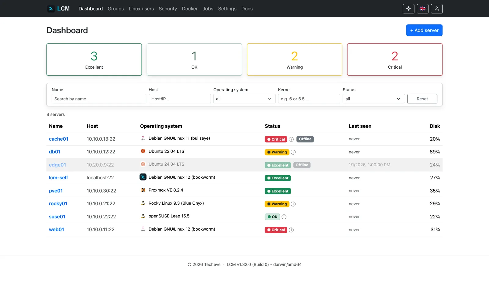
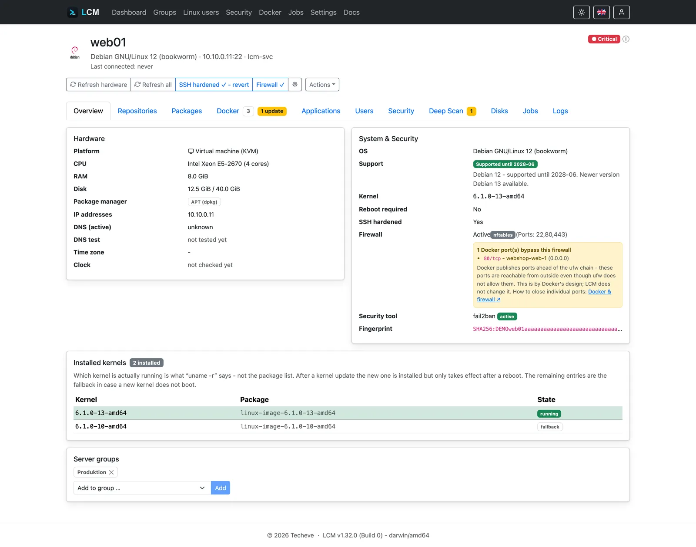
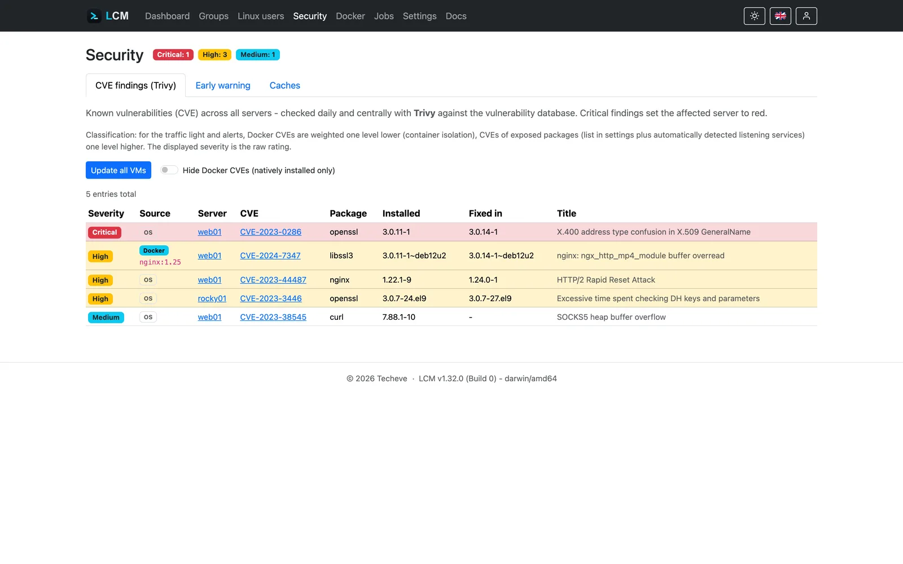
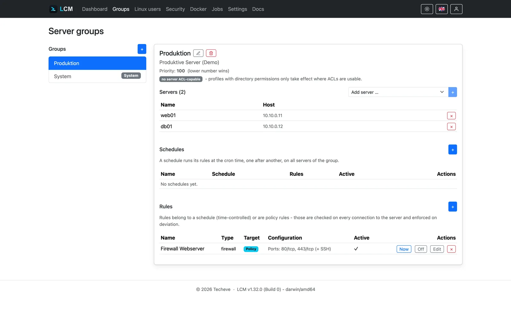
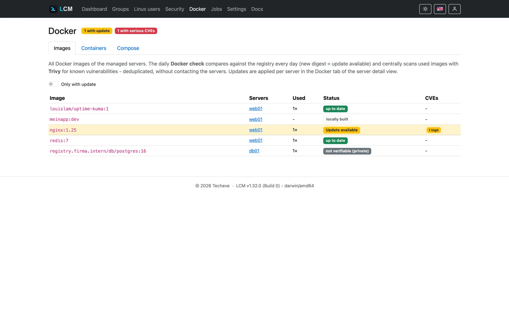
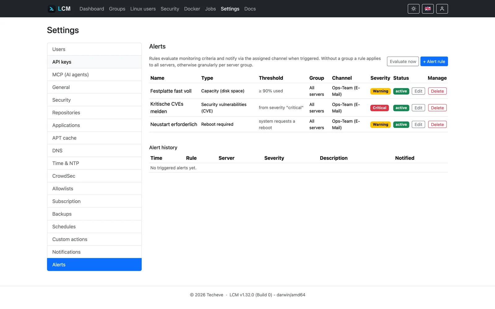
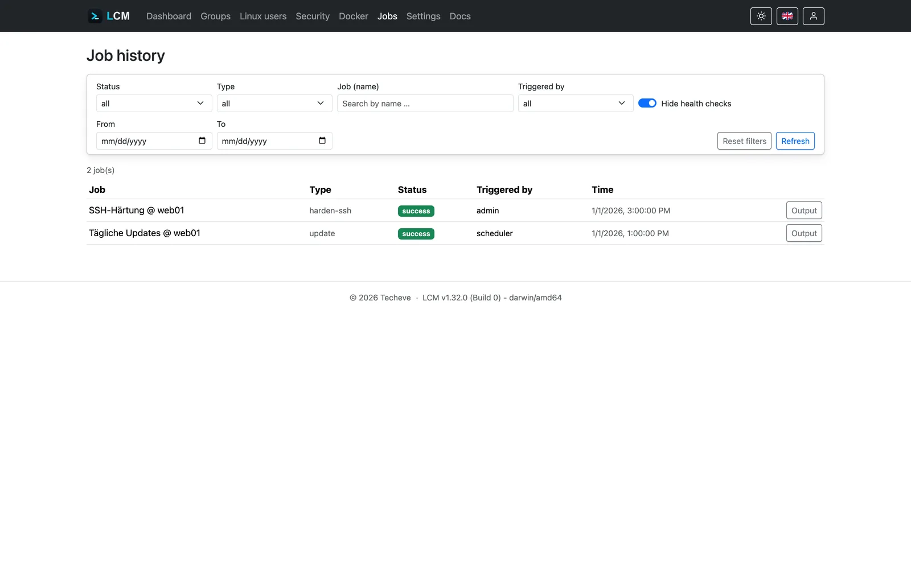
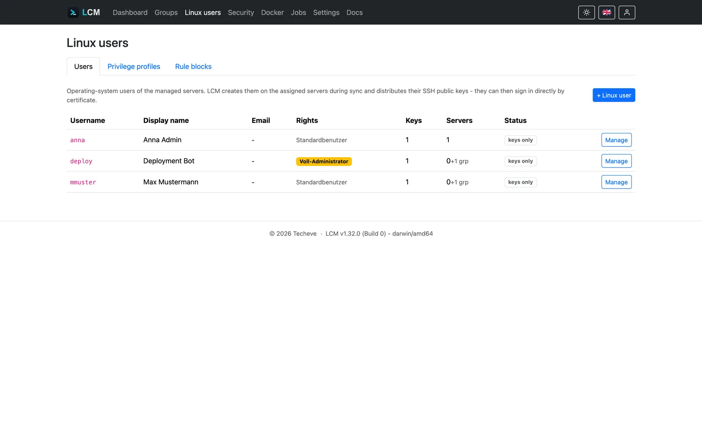
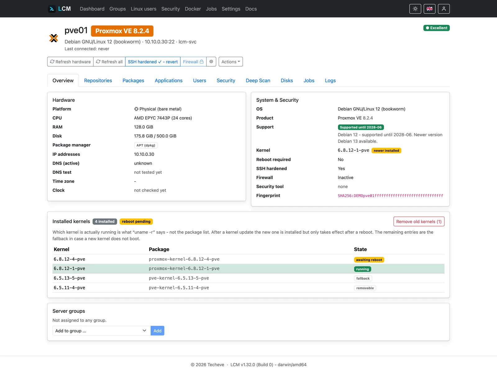

<p align="center">
  <picture>
    <source media="(prefers-color-scheme: dark)" srcset="logo/lcm-wordmark-dark.svg">
    <source media="(prefers-color-scheme: light)" srcset="logo/lcm-wordmark-light.svg">
    <!-- Fallback fuer Renderer ohne prefers-color-scheme (GitLab, Docker Hub):
         die Neutralvariante ist auf hellem wie dunklem Grund lesbar. -->
    
  </picture>
</p>

<h1 align="center">LCM - Linux Centralized Management</h1>

<p align="center">
  <strong>Agentenlose Verwaltung für den ganzen Linux-Serverpark - ein Binary, beliebig viele Server.</strong>
</p>

<p align="center">
  <a href="https://lcm-demo.techeve.de"><strong>Live-Demo</strong></a> ·
  <a href="https://techeve.de/produkte/lcm/">Website</a> ·
  <a href="https://doc.techeve.de/lcm/">Dokumentation</a> ·
  <a href="https://github.com/Techeve/LCM/releases">Releases</a> ·
  <a href="README.md">English</a>
</p>

> **Ohne Installation ausprobieren: [lcm-demo.techeve.de](https://lcm-demo.techeve.de/?mtm_campaign=linking&mtm_kwd=README)**
> Anmelden mit `demo` / `Just-Testing!26` (Administrator) oder `demo-manager`
> (eingeschränkte Sicht - sieht nur seine eigene Gruppe). Die Demo läuft gegen
> simulierte Server, ihr Funktionsumfang ist deshalb bewusst begrenzt: keine
> echten SSH-Verbindungen, und das Ändern von Zugängen, der Backup-Export oder
> das Aufnehmen eigener Server sind gesperrt. Alle 24 Stunden setzt sie sich
> auf den Ausgangszustand zurück - es darf also alles ausprobiert werden.

LCM ist eine selbst gehostete Verwaltungszentrale für Linux-Server. Einmal
installieren - ein einzelnes Binary ohne externe Abhängigkeiten - und beliebig
viele Maschinen über normales SSH verwalten: nichts auf den Zielservern
ausrollen, keine Agenten pflegen, keine Konfigurationssprache lernen.
Go-Backend (Fiber v3, GORM, SQLite) plus Svelte-5-Frontend (Vite, Bootstrap 5)
in **einem einzigen Binary** - lauffähig unter Linux, Windows und macOS.

Gebaut für den Alltag mit einem Serverpark - ob Homelab, Firmeninfrastruktur
oder Kundenmaschinen: auf einen Blick wissen, welche Server Aufmerksamkeit
brauchen, sie nach Zeitplan patchen, CVEs und volllaufende Platten erwischen,
bevor sie wehtun, und hinterher belegen können, wer was getan hat.

<picture>
  <source media="(prefers-color-scheme: dark)" srcset="docs/static/screenshots/dashboard-dark.webp">
  
</picture>

## Was man damit tut

- **Den Zustand jedes Servers auf einen Blick sehen** - Ampel-Status (🟢🟡🔴)
  pro Maschine, gespeist aus offenen Updates, CVE-Funden, Plattenkapazität und
  Erreichbarkeit, mit Detail-Insights einen Klick entfernt.
- **Ganze Gruppen nach Zeitplan patchen** - Servergruppen mit Regeln (tägliche
  Updates, Skripte, Sync), interner Cron-Scheduler und Concurrency-Lock pro
  Server gegen überlappende Jobs.
- **Schwachstellen früh erwischen** - der zentral erfasste Paketbestand aller
  Server wird täglich gegen die Trivy-Schwachstellendatenbank geprüft,
  SBOM-basiert, ohne Agent und ohne erneuten Server-Kontakt.
- **Docker-Deployments aktuell halten** - Container- und Image-Bestand je
  Server, zentrale Registry-Prüfung auf neuere Digests, CVE-Scan der genutzten
  Images und Ein-Klick-`pull && up -d` für Compose-Projekte.
- **Wissen, bevor die Platte vollläuft** - stündliche Kapazitätsmessung,
  verdichtet zu Tagesdurchschnitten, per linearer Regression hochgerechnet zur
  Prognose „wie lange reicht es noch", mit konfigurierbaren Alarmregeln und
  E-Mail-Benachrichtigung.
- **Benutzer und SSH-Keys zentral verwalten** - Benutzer und ihre Public Keys
  an einer Stelle, `authorized_keys` automatisch auf zugewiesene Server und
  Gruppen verteilt.
- **Belegen, wer was getan hat** - jede Aktion als Job mit exaktem
  SSH-Konsolen-Output, festgehalten in einer manipulationssicheren Hash-Chain.

## Screenshots

Alle Seiten gibt es in Hell und Dunkel - die Bilder folgen dem System-Theme.
Aufgenommen im eingebauten Demo-Modus (`lcm --demo`).

<table>
  <tr>
    <td width="50%">
      <picture>
        <source media="(prefers-color-scheme: dark)" srcset="docs/static/screenshots/server-web01-dark.webp">
        
      </picture>
      <em>Server-Detail: Hardware, Updates, Firewall, Kernel</em>
    </td>
    <td width="50%">
      <picture>
        <source media="(prefers-color-scheme: dark)" srcset="docs/static/screenshots/security-dark.webp">
        
      </picture>
      <em>Security: CVE-Funde über den ganzen Serverpark</em>
    </td>
  </tr>
  <tr>
    <td width="50%">
      <picture>
        <source media="(prefers-color-scheme: dark)" srcset="docs/static/screenshots/groups-dark.webp">
        
      </picture>
      <em>Gruppen: Mitglieder, Zeitpläne und Policy-Regeln</em>
    </td>
    <td width="50%">
      <picture>
        <source media="(prefers-color-scheme: dark)" srcset="docs/static/screenshots/docker-dark.webp">
        
      </picture>
      <em>Docker: Container, Compose-Projekte, Image-Updates</em>
    </td>
  </tr>
  <tr>
    <td width="50%">
      <picture>
        <source media="(prefers-color-scheme: dark)" srcset="docs/static/screenshots/alerts-dark.webp">
        
      </picture>
      <em>Alarme: Regeln, Schwellwerte, Benachrichtigungskanäle</em>
    </td>
    <td width="50%">
      <picture>
        <source media="(prefers-color-scheme: dark)" srcset="docs/static/screenshots/jobs-dark.webp">
        
      </picture>
      <em>Jobs: jede Aktion protokolliert, mit vollem Konsolen-Output</em>
    </td>
  </tr>
  <tr>
    <td width="50%">
      <picture>
        <source media="(prefers-color-scheme: dark)" srcset="docs/static/screenshots/linux-users-dark.webp">
        
      </picture>
      <em>Linux-Benutzer: zentrales User- und SSH-Key-Provisioning</em>
    </td>
    <td width="50%">
      <picture>
        <source media="(prefers-color-scheme: dark)" srcset="docs/static/screenshots/server-pve01-dark.webp">
        
      </picture>
      <em>Proxmox-VE-Hosts werden erkannt und als solche angezeigt</em>
    </td>
  </tr>
</table>

## Kernfunktionen im Detail

- **Server-Onboarding (Join)** - geführter Anmeldeprozess mit SSH-Host-Key-Fingerprint-Bestätigung (MitM-Schutz), automatischer Provisionierung eines dedizierten Service-Users und **einem einzigartigen SSH-Schlüsselpaar pro Server** (Zero Trust, begrenzter Blast Radius)
- **Monitoring** - Pakete & Versionen, überfällige Updates, Repositories, Hardware (CPU, RAM, Festplatte, IPs); Ampel-Status 🟢🟡🔴 pro Server mit Detail-Insights (auch CVE-getrieben: kritische Lücke → rot, hohe → gelb)
- **CVE-Scan (Trivy)** - der zentral erfasste Paketbestand aller Server wird täglich gegen die Trivy-Schwachstellendatenbank geprüft (SBOM-basiert, ohne Agent und ohne erneuten Server-Kontakt); Funde pro Server im Sicherheit-Tab und global auf der Security-Seite. Trivy ist optional - fehlt es, deaktiviert sich das Feature sauber
- **Docker-Monitoring & -Updates** - der System-Scan erfasst Container (inkl. Compose-Projekten) und Images jedes Servers; der Docker-Check (Teil des täglichen System-Sync) prüft zentral über die Registry-API, ob hinter einem Tag ein neuerer Digest steht, und scannt genutzte Images dedupliziert mit Trivy auf CVEs (gleiche Ampel/Alarme wie der Paketbestand). Compose-Projekte lassen sich aus LCM per `pull && up -d` aktualisieren, Standalone-Images per `docker pull`; ungenutzte Images einzeln löschen oder per Gruppen-Regel aufräumen
- **APT-Cache (apt-cacher-ng)** - zentraler Paket-Cache fürs ganze Serverpark: Cache-URL in den Einstellungen mit Live-Erreichbarkeits-Check, Server per Ein-Klick-Aktion anbinden (mit Funktionstest und automatischem Rollback) oder per Gruppen-Regel erzwingen (Drift-Check bei jeder Verbindung). Der Katalog bekannter Paketquellen (Docker, PostgreSQL, …) ist unter Einstellungen → Repositories pflegbar. Anleitung: [docs/guides/apt-cache.mdx](docs/guides/apt-cache.mdx)
- **Speicher-Verlauf & -Prognose** - der Health-Check misst stündlich die Festplattenbelegung, verdichtet sie zu Tagesdurchschnitten (Aufbewahrung 90-365 Tage einstellbar) und rechnet per linearer Regression hoch, wie lange die Kapazität noch reicht („Unbegrenzt" ab > 1 Jahr)
- **Alarme & Benachrichtigungen** - konfigurierbare Alarm-Regeln (Festplatten-Grenzwert, Speicherprognose, CVE-Funde, überfällige Updates, Heartbeat) mit Schwere, Cooldown und E-Mail-Versand über konfigurierbare Kanäle
- **Automatisierung** - Servergruppen mit Rules (tägliche Updates, Skripte, Sync), interner Cron-Scheduler, Health-Check alle 15 Minuten, Concurrency-Lock pro Server gegen überlappende Jobs
- **User-Provisioning** - zentrale Verwaltung von Benutzern und deren SSH-Public-Keys, automatische Verteilung der `authorized_keys` auf zugewiesene Server/Gruppen
- **Security Automation** - SSH-Hardening (nur Zertifikats-Login), Firewall-Checks (ufw)
- **Lückenloses Auditing** - jede Aktion als Job/AuditLog mit exaktem SSH-Konsolen-Output, manipulationssichere Hash-Chain, konfigurierbare Log-Retention (Default 90 Tage)
- **Rollen & Rechte** - Admins, Manager (nur zugewiesene Server, Tenant Isolation auf Query-Ebene), Service-Accounts (API-Keys mit Laufzeit), normale User als Key-Identitäten
- **Security by Design** - AES-256-GCM-Verschlüsselung sensibler Daten at-rest (Master-Key in `lcm.key` oder `LCM_ENCRYPTION_KEY`), Key-Rotation (`rotate-db-key`, SSH-Zertifikats-Rotation), TOTP-2FA mit Enforcement, HTTPS by default (Self-Signed out-of-the-box, eigene Zertifikate konfigurierbar), Rate-Limiting, strikte Security-Header, optionale **IP-Allowlist** (`allowed_ips` in der config.json: nur localhost, private Netze oder ausgewählte Adressen/CIDRs)
- **Dark Mode** - umschaltbarer Farbmodus (System/Dunkel/Hell) über die Navigationsleiste; folgt standardmäßig dem Betriebssystem und merkt sich die Wahl im Browser
- **System-Backups** - passphrase-verschlüsseltes, portables `.lcmbak`-Archiv (DB-Momentaufnahme + Master-Key + Config + TLS) mit konfigurierbarem Intervall/Aufbewahrung; Download, Rollback auf einen früheren Stand und Restore aus hochgeladenem Archiv (auch auf frischer Instanz), angewendet beim Start

## Wie ordnet sich LCM ein?

- **Ansible & Co.** sind Task-Runner: Sie führen aus, was man skriptet, und
  vergessen es dann. LCM ist eine dauerhafte Zentrale **mit Zustand** -
  Monitoring, CVE-Funde, Plattenverlauf, Audit-Trail - und braucht keine
  Playbooks. Beides ergänzt sich gut; LCM übernimmt den Betriebsteil.
- **Foreman, Uyuni & Co.** sind mächtige, aber schwergewichtige Plattformen:
  mehrere Dienste, echte Hardware-Anforderungen, Tage für die Einrichtung. LCM
  ist ein Binary und beantwortet fünf Minuten nach dem Download Fragen.
- **Canonical Landscape** hängt an einer Distribution und einem
  Hersteller-Abo. LCM verwaltet Debian, Ubuntu, RHEL-Derivate, openSUSE und
  Proxmox VE nebeneinander - und die Community Edition ist AGPL-Open-Source.

## Installation (Debian/Ubuntu, empfohlen)

Über das TechEve-APT-Repository - einmal einrichten, dann installieren und per `apt upgrade` aktuell halten:

```sh
curl -fsSL https://repo.techeve.de/setup.sh | sudo sh   # Repo + Signaturschlüssel
sudo apt install lcm                                    # installieren
sudo apt update && sudo apt upgrade                     # später aktualisieren
```

Das richtet LCM als unprivilegierten `systemd`-Dienst ein (Autostart, HTTPS). Das initiale Admin-Passwort steht im Journal: `journalctl -u lcm | grep -A3 'Admin-Zugang'`. Ohne Repo: einzelnes `.deb` aus den [Releases](https://gitlab.techeve.de/techeve/lcm/-/releases?mtm_campaign=linking&mtm_kwd=README) mit `sudo apt install ./lcm_<version>_<arch>.deb`. Weitere Wege (Docker, Quellcode): [Installations-Doku](docs/getting-started/installation.md).

## Quickstart (aus dem Quellcode)

```sh
make build     # npm audit → vite build → govulncheck → go build
./bin/lcm      # Erster Start: erzeugt config.json, lcm.key + DB, gibt Admin-Passwort aus
```

Dann die ausgegebene Adresse öffnen und mit dem initialen Admin-Zugang anmelden.

**Demo-Modus** (Test-Server, simulierte Hardware, Job-Historien - ohne echte Linux-Server). Nur über dieses Flag aktivierbar (bewusst kein config.json-Feld) und wirkt nur beim ersten Start mit frischer Datenbank - ohne das Flag startet eine Neuinstallation leer:

```sh
./bin/lcm --demo
```

**Entwicklung** mit Hot-Reload:

```sh
make dev       # Backend :9310 + Vite-Dev-Server :5173
```

**Tests:**

```sh
make test      # Go Unit-/Integrationstests (In-Memory SQLite)
make test-e2e  # Playwright E2E gegen das echte Binary
```

## Dokumentation

Die vollständige Dokumentation ist unter
**[doc.techeve.de/lcm](https://doc.techeve.de/lcm/?mtm_campaign=linking&mtm_kwd=README)** veröffentlicht (Deutsch
und Englisch) und liegt als **reines Markdown** in diesem Repository unter
[`docs/`](docs/) - Deutsch in der Wurzel, Englisch unter
[`docs/en/`](docs/en/). Das Repo enthält bewusst **kein** Astro/Node/npm-Gerüst:
Die CI baut die Seiten mit dem zentralen
[Astro-Starlight](https://starlight.astro.build/)-Builder-Image
(`techeve/docs-builder`) und liefert sie aus (Jobs `docs-build`/`docs-deploy` in
[.gitlab-ci.yml](.gitlab-ci.yml)). Die Seitenleiste entsteht automatisch aus der
Ordnerstruktur; jede Seite braucht nur ein `title`-Frontmatter.

Aufbau (jeweils DE + EN):

| Bereich | Inhalt |
|---|---|
| **Erste Schritte** | Überblick, Installation, Schnellstart |
| **Anleitungen** | Monitoring, Gruppen/Regeln, Sicherheit & CVE, Docker, APT-Cache, Linux-Benutzer, Backups, Alarme |
| **Beispiele** | typische Arbeitsabläufe Schritt für Schritt |
| **Referenz** | Architektur, Datenbank & Migrationen, Frontend & API, Sicherheitsmodell, Abhängigkeiten & Supply Chain, Paketierung, CI/CD & Releases |

## Open Source & Mitmachen

LCM ist **Open Source unter der [AGPL-3.0](LICENSE)**. Die Entwicklung findet in
einem internen Repository statt; das öffentliche Repository erhält bei jedem
Release automatisch den vollständigen Stand der Branches `community` (stabile
Releases) und `beta` (Vorabversionen) - inklusive History und Release-Tags.

**Ideen, Wünsche und Fehlermeldungen sind ausdrücklich willkommen**: als Issue
im öffentlichen Repository. Wir besprechen jeden Vorschlag intern und geben das
Ergebnis im Issue zurück. Auch Code-Beiträge per Merge Request nehmen wir gerne
an - der Ablauf (Review hier, Übernahme per Cherry-pick unter Erhalt deiner
Autorenschaft, [CLA](CLA.md)) steht in [CONTRIBUTING.md](CONTRIBUTING.md).

LCM gibt es in drei Kanälen aus dem TechEve-APT-Repository: **stable**
(Community-Edition, jedes Release), **beta** (Vorabversionen zum Mittesten) und
**enterprise** (konservativer Wartungszweig mit Subscription - gleiche Features,
Funktions-Updates erst nach bewährter Feldphase, Fixes dafür umso schneller).

## Entwicklung & Releases (GitLab)

Entwickelt wird im internen Repository
(`gitlab.techeve.de/techeve/lcm-intern`) mit geschütztem Workflow; das
öffentliche Repository [`techeve/lcm`](https://gitlab.techeve.de/techeve/lcm?mtm_campaign=linking&mtm_kwd=README)
erhält bei jedem Release den Schnappschuss der Branches `community` und `beta`:

- **Gearbeitet wird auf `develop`** (Standard-Branch) bzw. auf Feature-Branches mit MR nach develop.
- **Die Kanal-Branches `beta`, `community` und `enterprise` sind gesperrt**: kein direkter Push - Änderungen kommen ausschließlich per Merge Request, die CI-Pipeline muss grün sein. Welcher Kanal welches Publikum bedient, steht in [docs/reference/repo-channels.md](docs/reference/repo-channels.md).
- **CI/CD** ([.gitlab-ci.yml](.gitlab-ci.yml)): npm audit → Go-Tests → govulncheck → Playwright-E2E → Cross-Compile aller Plattformen.
- **Dependency-Bot** ([renovate.json](renovate.json)): Renovate prüft wöchentlich die Go-Module und npm-Pakete auf Updates und legt sie automatisch als Merge Requests an - frühestens sieben Tage nach Veröffentlichung, und selbsttätig gemerged wird nur bei Herausgebern mit belastbarem Release-Prozess ([Begründung](docs/reference/dependencies.md)). Läuft nur als CI-Image - keine Projekt-Abhängigkeit. Details: [docs/reference/ci-release.md](docs/reference/ci-release.md).
- **Automatische Releases**: Commits folgen [Conventional Commits](docs/reference/ci-release.md) (`feat:`, `fix:`, `feat!:` …). Version und [CHANGELOG.md](CHANGELOG.md) werden mit `make prepare-release` auf `develop` vorbereitet - sie stehen damit in genau dem Commit, der später getaggt wird. Beim Merge in einen Kanal-Branch erzeugt die Pipeline Tag und Release samt aller Binaries; sie schreibt nichts ins Repository zurück und braucht deshalb keinen Schreib-Token. Vorschau: `make next-version`.

## Stack

Go · Fiber v3 · GORM · SQLite (CGO-frei) · x/crypto/ssh · argon2id · JWT · AES-256-GCM - Svelte 5 (Runes) · Bootstrap 5 · Vite - Playwright · govulncheck · npm audit

## Abhängigkeiten & Supply Chain

**Keine externen Pakete für Probleme, die sich mit wenigen Zeilen eigenem Code lösen
lassen** - das System bleibt leichtgewichtig, sicher und wartbar. Umgekehrt gilt
genauso: **kein Eigenbau bei Kryptographie und Protokoll-Parsing**, dort ist die
selbst eingebaute Lücke wahrscheinlicher als der Supply-Chain-Angriff, den man
vermeiden wollte. Konkret heißt das:

- **Bewertung nach zwei Achsen** - Trägerschaft (Organisation mit Release-Prozess
  oder Einzelperson mit Bus-Faktor 1?) und tatsächlich genutzte Nutzfläche.
  Abhängigkeiten von faktisch verwaisten Projekten nehmen wir nicht auf.
- **Selbst bauen nur**, wenn keine Kryptographie, kein Parsing fremder Daten und
  ein harmloses Fehlerbild zusammenkommen - so entstanden Logrotation und
  QR-Kodierung im Projekt.
- **Der Update-Pfad ist das eigentliche Risiko.** `go.sum` und
  `package-lock.json` verhindern nachträgliche Manipulation; ein Angriff kommt
  deshalb immer als *neue* Version. Renovate hält daher sieben Tage Karenzzeit
  ein und merged nur bei Herausgebern mit belastbarem Release-Prozess selbsttätig.
- **Keine npm-Installationsskripte** in CI und Build (`--ignore-scripts`) - sie
  laufen auf dem Runner mit Zugriff auf Tokens und Signaturschlüssel.

Regeln, Checkliste und die Bewertung des aktuellen Bestands:
[docs/reference/dependencies.md](docs/reference/dependencies.md).
