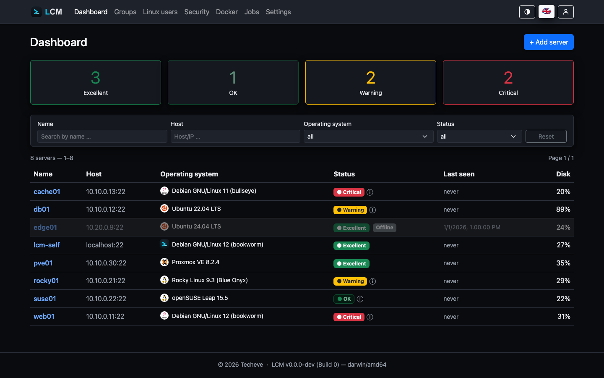

---
sidebar:
  order: 1
title: Overview
description: What LCM is, the problems it solves and how it is roughly structured.
---

**LCM (Linux Centralized Management)** manages any number of Linux servers
centrally over SSH - with no agent on the target systems. Backend (Go) and
frontend (Svelte 5) ship as **a single binary** that keeps its data in a local
SQLite file.

## Why LCM?

- **Agentless.** Nothing needs to be installed on the managed servers. LCM
  connects over SSH, reads the state and runs actions as a dedicated service
  user.
- **Zero trust per server.** Every server gets its **own** SSH key pair during
  onboarding. A compromised key never endangers the whole fleet.
- **One binary, no runtime dependencies.** Copy, start, done - on Debian and
  Ubuntu (other Linux distributions work but are not part of our testing).
- **Security built in.** Sensitive data is stored AES-256-GCM-encrypted in the
  database; access is protected by RBAC and optional 2FA.

## Core features at a glance

| Area | What LCM does |
|---|---|
| **Onboarding** | Guided join with host-key confirmation (MitM protection), service user + own key pair per server |
| **Monitoring** | Packages, updates, repositories, hardware; **Excellent** / OK / 🟡 / 🔴 status with insights (incl. EOL & reachability) |
| **Disks** | All mounted volumes with usage; hourly history + forecast of the root filesystem |
| **CVE scan** | Daily Trivy scan of the package inventory (SBOM-based, no extra server contact), context-aware weighting |
| **Docker** | Inventory of containers/images, central registry update check, image CVE scan |
| **APT cache** | Attach to apt-cacher-ng via one-click action or group rule |
| **Firewall** | Multi-backend (ufw/firewalld/nftables) per distribution, detailed rules with source restriction (allowlists + custom IPs) |
| **Security tools** | Install fail2ban or CrowdSec at the push of a button; central CrowdSec LAPI on the LCM host |
| **IP allowlists** | Named, reusable source-IP lists for firewall, fail2ban and CrowdSec |
| **Automation** | Server groups with scheduled and baseline rules, internal scheduler; actions like reboot, restrict privileges |
| **Users** | Manage Linux users centrally and distribute their SSH keys |
| **Backups** | Encrypted, portable `.lcmbak` archives with restore on startup |
| **Alerts** | Rule-based notifications (disk, CVEs, reboot, heartbeat …) via e-mail |
| **LCM Remote** | Servers connect outbound via an agent (NAT/roaming) - dedicated port, agent interface only |
| **RouterOS** | Onboard MikroTik devices and monitor their OS version currency |
| **MCP** | Read-only interface for AI agents (dedicated port, authentication, no secrets) |

## Architecture in one sentence

An HTTP server (Fiber) serves the embedded Svelte frontend and exposes a REST
API; an internal cron **scheduler** triggers jobs that an **executor** runs on
the target servers over short-lived SSH connections and records as **jobs**
including console output.

More detail: [Architecture](/en/reference/architecture/).

## Where to next?

1. [Installation](/en/getting-started/installation/) - binary, `.deb` or Docker.
2. [Quickstart](/en/getting-started/quickstart/) - onboard your first server.
3. [Servers & Monitoring](/en/guides/monitoring/) - the day-to-day workflow.
