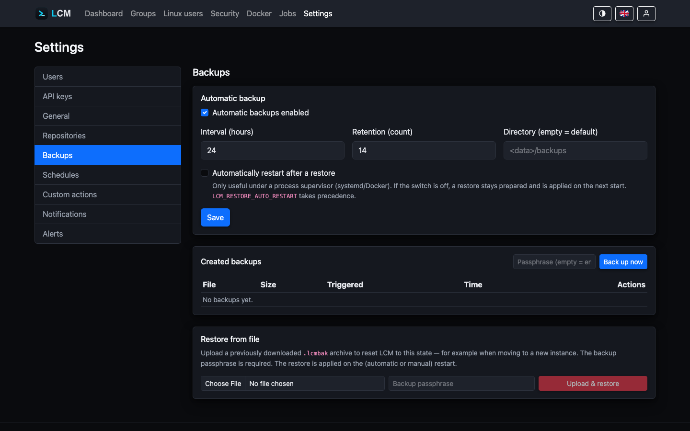

---
sidebar:
  order: 17
title: Backups
description: Create, download, and restore encrypted, portable .lcmbak archives.
---

LCM backs up its **own** state into a passphrase-encrypted,
portable archive. A backup contains everything that makes up an instance - it can
be fully restored on a **fresh** instance.

## What's in the archive

An `.lcmbak` (ZIP with AES-256-GCM / scrypt key derivation) bundles:

- the **database snapshot** (consistent SQLite snapshot),
- the **master key** (`lcm.key`) - without it the at-rest encrypted
  fields would be unreadable,
- the **configuration** (`config.json`),
- the **TLS certificate**.

:::caution[Passphrase]
The backup passphrase comes from the environment variable
`LCM_BACKUP_PASSPHRASE` (or is prompted for during manual creation) and is
**never** stored in the database or configuration. Without it a
backup cannot be restored - keep it safe.
:::



## Create a backup now

Under *Settings → Backups*, **"Create backup now"** immediately produces an
archive; the passphrase is prompted for. LCM takes a **consistent** snapshot of
the database (`VACUUM INTO`) for this - so a backup can be created while
running.

## Automatic backups

For automatic backups to run, **exactly two things** are required - both are
shown directly on the *Settings → Backups* page:

1. **"Automatic backups enabled"** is switched on (default: on, every
   24 hours).
2. The **passphrase is set as an environment variable** -
   `LCM_BACKUP_PASSPHRASE` for the LCM service. An unattended backup cannot
   prompt for it; without it, **every** scheduled backup fails (visible as a
   failed "System-Backup" job on the *Jobs* page).

Whether the passphrase is set is shown on the Backups page as a badge
(**"Passphrase set"** / **"Passphrase missing"**); if it is missing while
automatic backups are enabled, a prominent warning with instructions appears
as well. This is how to set it - as a systemd drop-in
(`/etc/systemd/system/lcm.service.d/backup.conf`):

```ini
[Service]
Environment=LCM_BACKUP_PASSPHRASE=a-long-secret
```

then:

```bash
systemctl daemon-reload && systemctl restart lcm
```

Or in Docker Compose:

```yaml
services:
  lcm:
    environment:
      LCM_BACKUP_PASSPHRASE: a-long-secret
```

:::caution
Without `LCM_BACKUP_PASSPHRASE` set, a scheduled backup fails with a passphrase
error - no unencrypted archive is ever created. Manual backups keep working
(the form prompts for the passphrase).
:::

Further settings:

- **Interval** (hours) and **retention** (count) - older backups are cleaned
  up automatically.
- **Time of day** - anchors the schedule at a fixed time (server time). If
  the interval divides the day (1, 2, 3, 4, 6, 8, 12 or 24&nbsp;hours),
  backups run at fixed times derived from it - e.g. interval 12&nbsp;h and
  time 03:30 → runs at 03:30 and 15:30. Other intervals run relatively; the
  catch-up watchdog keeps them on track.
- **Target directory** - always set and pre-filled with the default
  (`backup_dir` from config.json, otherwise `<data-dir>/backups`). It can be
  changed freely - handy for a persistent/external volume; clearing the field
  restores the default on save.

### Overdue backups are caught up

For intervals that cannot be expressed as fixed times of day, the schedule
counts from instance start. So that an instance that
**restarts more often than the interval is long** (e.g. due to regular
updates) still gets backed up, a watchdog checks every few minutes: if the
newest backup is older than the interval (or none exists yet), a backup is
**caught up immediately** - shortly after startup, with no action required. A
fresh manual backup also counts as covering the interval.

## Restore

Two paths:

1. **From history** - select an earlier backup directly for
   restoration.
2. **From an uploaded archive** - upload an `.lcmbak`, even on a
   **fresh** instance (fresh-instance restore).

The restore runs via **staging + apply-on-startup**: LCM stages the
files to be restored and applies them on the next start.
Whether LCM restarts itself for this is controlled by `RestoreAutoRestart` or the
environment variable `LCM_RESTORE_AUTO_RESTART` - sensible only under a
process supervisor (systemd/Docker with a restart policy). If auto-restart is off,
the restore stays prepared and the operator starts manually.

The environment variable takes **precedence** over the UI setting (truthy
values are `1`, `true`, `yes`, `on`). On the orderly restart LCM exits with a
non-zero exit code so that `Restart=on-failure` (systemd) or a Docker restart
policy kicks in:

```ini
[Service]
Environment=LCM_RESTORE_AUTO_RESTART=1
Restart=on-failure
```

:::tip
After triggering a restore, the UI logs you out automatically -
the session of the old instance is no longer valid afterwards.
:::
