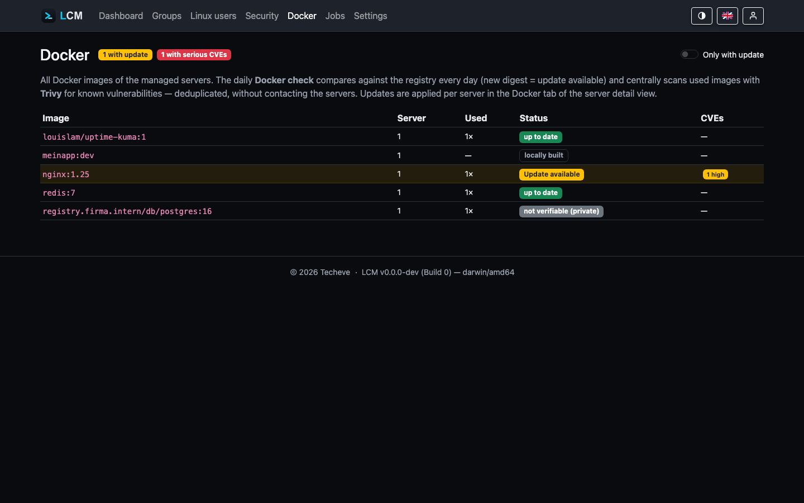
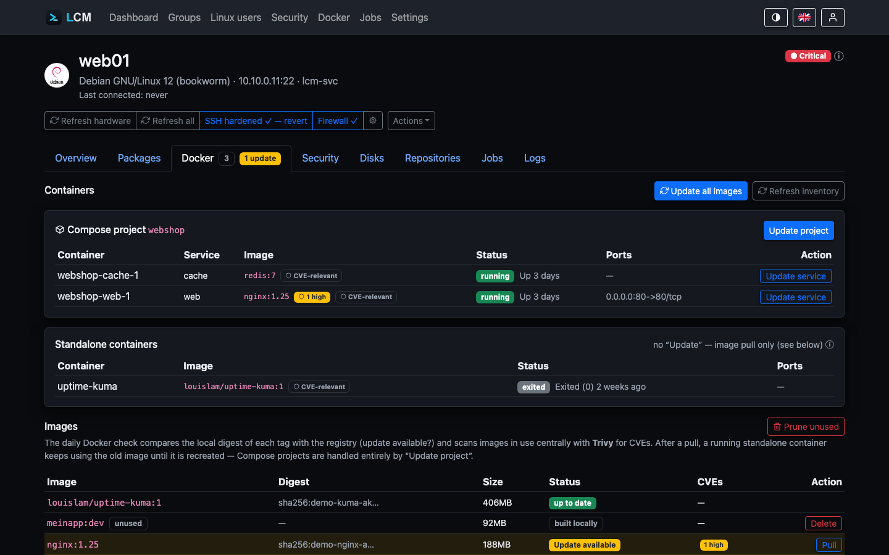

---
sidebar:
  order: 13
title: Docker Monitoring
description: Container and image inventory, central registry update check, and image CVE scans.
---

LCM captures the Docker inventory of every server and checks centrally whether
images are outdated or vulnerable. The update check runs entirely on the
LCM host - the servers are not contacted for it.

## Inventory (agentless)

The system sync captures per server:

- **Containers** (`docker ps -a`) including their assignment to the Compose
  project via the `com.docker.compose.*` labels,
- **Images** (`docker images --digests`).

The server flags `has_docker` / `has_compose` indicate whether Docker or Compose
is present. Podman and Compose v1 are out of scope.

## Central update check

The **Docker check** is part of the daily system sync (see
[Monitoring](/en/guides/monitoring/)). It queries the registry HTTP API for the
current digest behind each tag and compares it with the locally recorded
digest - **deduplicated** per reference (`nginx:1.25` on 12 servers = 1
registry call). Result per image:

- **Update available** - the registry carries a newer digest.
- **not checkable (private)** - private registry, not queryable anonymously.
- **built locally** - no registry digest, not checkable.

The **global Docker page** lists every unique image across all visible
servers, with a usage count and CVE badges - handy for spotting at a glance
how many servers still run an outdated `nginx:1.25`:



## Image CVE scan

In the same run LCM scans the **used** images with Trivy - addressed by
`repo@digest` (exactly the running state) and deduplicated per (repository,
digest). The findings land in the same vulnerability table as the package
scan. By default they do **not** feed status/alerts - image CVEs only count,
at full severity, for containers marked as **CVE-relevant** in the container
table (critical → 🔴, high → 🟡; see
[Status calculation](/en/guides/status/)). Outdated used images → 🟡.

## Actions

The Docker tab of a server (screenshot below, server `web01`) shows a
Compose project with two services (`webshop`) and a standalone container
(`uptime-kuma`), followed by the image inventory with the CVE-relevant
toggle per container.



- **Update Compose project** - `docker compose pull && up -d` in the
  project's `working_dir`. A single service within the project can be
  targeted individually via "Update service".
- **Update standalone image** - `docker pull` (recreating the
  container is deliberately left to the operator, see the hint in the UI).
- **Update all images** - pulls all in-use, tagged registry images of the
  server in one job (`docker pull` per image); locally built images are left
  untouched.
- **Mark as CVE-relevant** - a toggle per container: by default, Docker CVEs
  do **not** feed the traffic light/alerts (see
  [Status calculation](/en/guides/status/)); the toggle explicitly marks a
  container as relevant, e.g. when its image is directly reachable from
  outside.
- **Delete unused image** - individually via button (`docker rmi`).
- **Cleanup rule** - the group rule "Docker: clean up unused images"
  (`docker-prune`) cleans up on a schedule via `docker image prune -af`.

All actions run as a logged SSH job with a subsequent
inventory rescan.

**Example:** a server runs ten containers from five different images, and
only `nginx:1.25` is exposed externally (port 80/443). Instead of treating
all five images as CVE-relevant, it's enough to mark just the `nginx`
container - its CVEs then count fully toward the traffic light, while the
other four images stay excluded unless someone marks them too.

## Server switches: watch instead of intervene

Under **Server → Settings → Docker** there are two switches that take a server
out of LCM's Docker operations. Both are **off** by default; nothing changes
until someone turns them on.

### Do not apply Docker updates

LCM no longer pulls new image versions on this server - neither manually
(compose update, image pull, "update all images") nor through a rule
(`docker-update-unused`). The actions are rejected, and a rule running across
a group skips the server with a note in the log instead of failing.

**Monitoring stays complete:** inventory, available updates and the image CVE
scan keep running. What is switched off is the applying, not the looking - you
still see what would be pending.

Intended for servers whose containers are maintained elsewhere: a separate
CI/CD pipeline, a vendor handling maintenance, or an environment with fixed
maintenance windows. An update from LCM is not misconfigured there - it is
simply not wanted.

### Ignore CVEs from container images

Findings from this server's container images stay out entirely: they do not
count towards status or alerts, and they do not appear in the **security
overview** - not even through its "Docker" source filter.

:::caution[The switch overrides the exceptions]
It also covers containers marked as **CVE-relevant** and those reachable from
the network **past the host firewall** - which would otherwise
[count automatically](#docker-and-the-host-firewall-ufw). Whoever does not
want to see a server's findings at all means all of them; the responsibility
for that sits visibly with the person flipping the switch.
:::

The findings remain in the **server's own CVE report**. That is deliberate:
the context is unambiguous there, the switch sits right next to it, and you
should be able to see what you are hiding. The overview across all servers
goes quiet; the truth about the individual one stays within reach.

Useful when the images come from a vendor whose contents you are not
responsible for - and when the alternative would be ignoring a permanently red
list. An inventory nobody looks at any more is worse than one that honestly
states it is not being examined.

## Docker and the host firewall (ufw)

Docker puts its forwarding rules in the `nat/PREROUTING` chain - **before** the
`INPUT` chain where ufw filters. A container port published with `-p 3001:3001`
is therefore reachable from outside **even when ufw is active and does not
allow it**. This is not a bug but intentional: Docker wants published ports to
work.

LCM detects this and **qualifies the firewall display** accordingly: next to
"Firewall: Active" the server overview then shows a notice listing the affected
ports and their containers. **LCM does not intervene** - whether a port should
be public is an operational decision and differs per container.

In addition, externally reachable containers **automatically count towards the
CVE assessment**. Docker findings otherwise only count when a container is
explicitly marked as CVE-relevant (see [status calculation](/en/guides/status/)) -
a container reachable from the network is the strongest candidate for that.

### Actually closing a port

Three ways, with different costs:

**1. Bind to loopback (recommended for internal services).** The cleanest
per-case fix: the port is only reachable locally, with a reverse proxy in front.

```yaml
# docker/docker-compose.yml
ports:
  - "127.0.0.1:3001:3001"   # instead of "3001:3001"
```

**2. The `DOCKER-USER` chain (for differentiated rules).** Docker traverses this
chain before its own rules and never touches it. A common rule set is
[`ufw-docker`](https://github.com/chaifeng/ufw-docker). Note: the rules
reference **container IPs**, not host ports - they must be maintained as the
stack changes.

```sh
iptables -I DOCKER-USER -i <external> -p tcp --dport 3001 -j DROP
```

**3. `iptables: false` in `/etc/docker/daemon.json` - not recommended.** Docker
then manages no iptables rules at all. This breaks container egress NAT and
inter-container communication unless you rebuild the entire rule set yourself.
Docker explicitly advises against it.

:::tip[Measure first]
Whether and how strongly the effect occurs on a given system depends on the
Docker version. An `iptables -t nat -L DOCKER -n` on the host plus a port scan
from outside shows the actual state in two minutes.
:::

## Running LCM itself with Docker

LCM can also run **as** a container (not to be confused with the
Docker monitoring of the managed servers). See
[Installation](/en/getting-started/installation/) and
[Packaging](/en/reference/packaging/) for Dockerfiles, a Compose example, and all
hardening flags.
