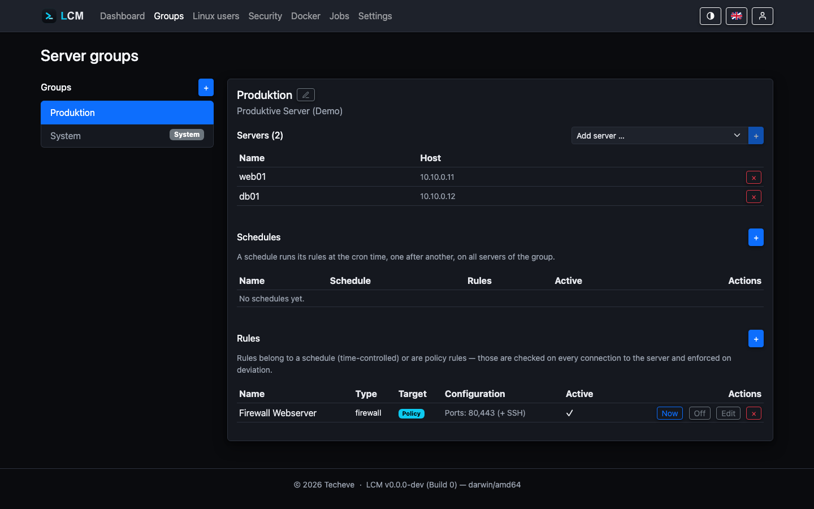

---
sidebar:
  order: 15
title: Groups, Schedules & Rules
description: Bundle servers and automate them with scheduled rules as well as baseline rules.
---

**Server groups** bundle servers to automate them together. A
group has **schedules** and **rules**; a schedule runs its
rules at cron time, one after another, on all servers in the group.



## Two kinds of rules

| Kind | When it runs | Examples |
|---|---|---|
| **Scheduled rule** | at the cron time of its schedule | daily updates, sync, scripts, bind APT cache |
| **Baseline rule (enforce)** | on **every** connection (at least on the health ping) | firewall, enforce APT cache - with drift check |

A baseline rule first checks the current state and intervenes **only on
deviation**. Firewall example: if the expected port configuration is already
active, nothing happens; if it deviates, it is re-applied. Every actual
intervention shows up as an audit entry and in the log - a change to a
production system should not live only in another job's output.

Baseline rules are therefore only available for types that actually carry a
target state: **firewall**, **APT cache**, **set up ACL** and **keep permission
state**.

The last two belong to the [privilege profiles](/en/guides/linux-users/): "set
up ACL" installs missing ACL support so that a profile's directory permissions
take effect on new members of the group at all; "keep permission state" restores
hardened directories and applied directory permissions after a package upgrade
has reset them. Conversely they cannot be attached to a schedule - they describe
a state, not an action at a given time.

A shell command, in turn, carries no target state at all: as a baseline rule it
would run unconditionally on every health check. A **schedule** is the right
place for that - there every run appears as its own job.

## Priority: when several groups govern the same server

A server may belong to any number of groups. If two of them carry a baseline
rule of the **same type**, they describe the same target state differently -
only one can take effect. The group's **priority** decides which one: **the
lower number wins** (read like MX and SRV records).

| Group | Priority | Meaning |
|---|---|---|
| your own groups | **100** (default) | freely choosable from 1 to 9999 |
| system group | **1000** | deliberately the weakest - its rules apply to every server and form the baseline that a more specific group may override |

The superseded rule is not executed, but it is named explicitly in the health
check report:

```
Grundsatz-Regeln:
  [Basis-Firewall] firewall ok - regel umgesetzt (ports: 22,443)
  [Web-Firewall] übersprungen - Vorrang liegt bei Gruppe "Basis-Härtung" (10).
```

If both groups share the **same** priority, the older group wins. That is
deterministic, but it is not a decision anyone made - LCM therefore reports such
cases in the log at startup and points out the tie in the health report. Set the
priority explicitly in that case.

Rules of **different** types do not contradict each other (firewall and APT
cache concern different things) - those all keep running. And scheduled rules
are not affected by priority at all: two update runs from two groups are not a
conflict, they are two jobs.

:::caution[Firewall baseline rule: the target state is mandatory]
A firewall baseline rule must state explicitly which ports should be open - as
JSON (`[{"port":443,"proto":"tcp"}]`) or as a port list (`"443,8080"`). Without
it the rule is **rejected**: it would otherwise close every service port on all
servers of the group and restore that state every 15&nbsp;minutes. If you
really want **only SSH** open, say so explicitly with the empty list `[]`.
:::

## Rule types

- **Update / package updates / security** - package upgrade via the detected
  package manager; "named" updates specific individual packages.
- **Script** - any shell command.
- **Custom action** - a command list configured under *Settings → Custom
  Actions* that runs sequentially.
- **Sync / health / package list** - the building blocks of the baseline schedules.
- **Firewall** - enable ufw and open the specified TCP ports (also
  available as a baseline rule).
- **Docker prune** - clean up unused Docker images.
- **Docker: update unused images** - pulls new versions of unused images
  (e.g. to keep base images ready for the next build without touching
  running containers).
- **Bind / enforce APT cache** - see [APT Cache](/en/guides/apt-cache/).
- **Reboot** - restarts the server (`systemctl reboot`); only makes sense as
  a scheduled rule, not as a baseline rule. The job stays open until the
  server responds again (see below).
- **Reboot if needed** - the same, but only when the system asks for it
  (`/var/run/reboot-required`, `needs-restarting -r`, `zypper
  needs-rebooting`). The question is asked **at run time**, not taken from
  the last scan: the update that makes a reboot necessary happens between
  the two. If the server reports no need, the job ends with "no reboot
  needed - skipped". This is the rule for a weekly maintenance window:
  downtime only when it buys something.

**Example:** a group "Webservers" with schedule "Nightly" (`0 3 * * *`) gets
two rules - first "Security updates", then "Reboot" (the reboot only makes
sense if the update run upgraded a kernel and `RebootRequired` is set, see
[Monitoring](/en/guides/monitoring/)). In addition, a baseline rule
"Firewall" with ports `80,443` ensures the firewall configuration is checked
on every connection and restored immediately on deviation - independent of
the nightly schedule.

:::note[Not every rule type can be chosen per group]
The domain model and the OpenAPI reference list further types - `cve-scan`,
`alert-check`, `backup` and `docker-check`. These run **exclusively as system
schedules** on a fixed interval and cannot be created as a group rule; such an
attempt is rejected with "ungültiger rule-typ". The list above is therefore
complete for what is selectable under *group → rules*.
:::

## A reboot waits for the server to come back

A reboot - whether triggered from the server detail view or as a scheduled
rule - does not end when the command is sent. LCM then checks in the
background whether the server returns:

| | |
|---|---|
| Settling delay | 15 seconds before the first attempt counts |
| Check interval | every 2 seconds |
| Time window | 10 minutes |

The settling delay is not optional: the reboot command returns immediately,
but the server only shuts down seconds later. Without it, the first attempt
would reach the still-running server - and the reboot would be reported as
complete before it had even begun.

**If the server comes back**, the job completes with the wait duration
("server reachable again after 42s"), the server counts as reachable, and a
data refresh runs once. That is the moment the running kernel, the uptime and
any pending "reboot required" change - the state from before the reboot is
out of date.

**If it does not come back**, the job fails after 10 minutes with exactly that
statement plus the last connection error. A server that does not return from a
reboot thus stands as an incident, not as a completed action.

While the watch is running the job stays open and holds the server lock -
during a reboot nothing else should be running on that server anyway.

## Creating a rule

import { Steps } from '@astrojs/starlight/components';

<Steps>

1. Under *Groups*, select the group (or create a new one) and assign servers
   to it.
2. For a scheduled rule, first create a **schedule** (name +
   cron expression, e.g. `0 2 * * *`).
3. Via **"+ New Rule"** set the type, target (schedule *or* baseline), and
   optionally the configuration (ports, package names, action).
4. Using **"Now"** you can trigger a rule or an entire schedule
   immediately.

</Steps>

## The System group

The protected System group brings the baseline schedules (health check,
system sync); its rules and schedules cannot be deleted. Its schedules
run on **all** servers - regardless of group membership. For details
see [Monitoring](/en/guides/monitoring/).

## Good to know

- A configuration changed later (e.g. a new APT cache URL) takes
  effect automatically on all servers of the group through the baseline rule.
- Demo servers are never contacted over SSH - rule runs there are
  simulated.
