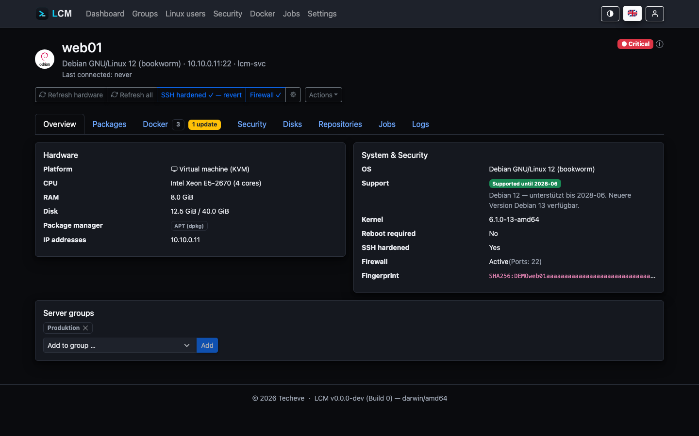

---
sidebar:
  order: 10
title: Servers & Monitoring
description: Understand inventory collection, the traffic-light status, storage history, and the baseline schedules.
---

For every connected server, LCM regularly captures the current state and
condenses it into a traffic-light status. Contact happens over short-lived
SSH connections; the managed servers need no agent.

## What gets captured

- **Operating system & platform** - distribution, version, kernel, virtualization
  (bare metal, VM, LXC), and OS support status (Ubuntu, Debian and the RHEL
  family: Red Hat Enterprise Linux, Rocky Linux, AlmaLinux, CentOS Stream).
- **Hardware** - CPU model/cores, RAM, disk, IP addresses.
- **Disks/volumes** - all mounted filesystems (passed-through storage volumes,
  not physical disks) with usage; the root volume `/` stays authoritative for
  the traffic light and forecast.
- **Reboot required** - LCM detects when the server requests a reboot (e.g.
  after a kernel update, like Ubuntu's login hint).
- **Packages** - installed packages including available updates; separated by
  package manager (apt/dpkg, dnf/yum/RPM, zypper, pacman, apk) and **Snap**.
- **Repositories** - configured package sources along with a security assessment
  (HTTPS, signed). The maintainable catalog of known package sources
  (Settings → Repositories) assigns each entry to a package manager and only
  offers it on matching servers; the APT cache binding (apt-cacher-ng) applies
  to apt systems only.

  Unencrypted sources can be switched to **https** in one go; if `apt-get
  update` fails afterwards, LCM rolls the change back. The switch is
  **reversible**: LCM keeps the backup copies of the source files under
  `/var/backups/lcm-apt-https` and therefore still knows later which source
  used to be http. Reverting affects **only those** - a third-party source
  that speaks https on its own stays untouched. On servers switched before
  LCM&nbsp;1.27 no such record exists; there LCM offers the distribution
  mirrors (`*.debian.org`, `*.ubuntu.com`, `*.raspberrypi.org`) for reverting.
  The confirmation shows which sources are affected before anything runs.
- **Docker** - containers (including Compose projects) and images, see
  [Docker Monitoring](/en/guides/docker/).
- **Applications** - software installed outside the package manager (AdGuard
  Home, Nextcloud, mailcow …) plus running services that belong to no package,
  see [Applications](/en/guides/apps/).

## Traffic-light status & insights

Every server has a status of 🟢 **Excellent** (rich green), 🟢 **OK** (light
green), 🟡 (Warning), or 🔴 (Critical). The status derives from several
signals - among them reachability, CVE findings (critical → red, high →
yellow), and OS support. The **ⓘ** next to the status opens a popover that
lists the concrete reasons ("insights") - you never have to guess why a server
isn't green.

### Red Hat: registration counts

On systems with `subscription-manager` LCM reads the registration state. The
reason is a fallacy that would otherwise pass unnoticed: an **unregistered RHEL
gets no package sources**. `dnf` finds nothing there - not because everything
is current, but because nobody could look. Without this finding such a server
would show "0 overdue updates" and thus look better than a well-kept one that
honestly reports three.

So LCM reports **🟡** when the system is not registered or its registration
carries no sufficient entitlement. "Disabled" counts as fine - with Simple
Content Access Red Hat no longer checks entitlements, and that is the normal
case. Rocky, AlmaLinux and CentOS do not know `subscription-manager`; the
finding is skipped there.

An operating system **out of support** (end-of-life) or **less than a month**
before end of support sets the server to **🔴 Critical** (see
[Security & CVE scans](/en/guides/security-cve/)).

**Excellent** requires a spotless server: not a single known CVE (not even low
ones), SSH hardening active and the firewall (ufw) active - Proxmox systems
bring their own firewall and count as covered. **OK** allows individual
low-severity CVEs as long as all updates (including security updates) are
installed.

For the traffic light and alerts, CVEs are **weighted**: findings from Docker
images do **not count at all** by default - they only count, at full severity,
for containers marked as **CVE-relevant** in the Docker tab. Findings of
exposed packages - web servers, proxies, SSH/mail/DNS servers, databases (list
under *Settings → General*, plus automatically detected services listening on
externally reachable ports) - count one level higher. The severity displayed
in the security views remains the raw rating.

All factors, thresholds and special cases in detail:
[Status calculation](/en/guides/status/).

## Disks, history & forecast

The **Disks** tab of the detail page lists all mounted **volumes**
(passed-through filesystems, not physical disks) with device, type and a usage
bar. The **root volume `/`** is marked "System" and stays authoritative for the
dashboard traffic light, history and forecast - it is the critical factor when
it fills up.

The health check measures the root filesystem's usage **hourly** (throttled) and
condenses it into **daily averages**. The tab shows a history from this (hovering
the chart reveals the percentage for each day) and extrapolates via **linear
regression** when capacity will be exhausted ("Unlimited" beyond one year). The
retention of the daily snapshots is configurable (90-365 days, *Settings →
General*).

:::note[Compressing filesystems]
LCM reads the actually **used blocks** (`df`), not the logical file size. On
ZFS or Btrfs with compression enabled the used amount is therefore below the
sum of the file sizes - this is correct and not a measurement error, but may
surprise when comparing both values.
:::

## Offline marker

A server is marked **Offline** as soon as it was unreachable on **two
consecutive** contact attempts - on the dashboard as well as in the server
detail view.

Why only on the second: a single failure is everyday business (a lost packet, a
reboot in progress, a brief network hiccup) and says nothing yet. Only the
repetition separates "not reached right now" from "is offline". Every
successful contact resets the counter - "consecutive" means consecutive.

Every reachability contact counts: the health ping (every 15 minutes by
default), refresh runs and rule executions. A **reboot** triggered by LCM
itself deliberately does not count - the server is expected to be away briefly,
which is not a failed check. If it does not come back, the next health pings
count it anyway.

:::note[Independent of the traffic light]
The marker only says the server does not answer - not how bad that is. Whether
the unreachability is tolerated controls the **colour** (see below), not the
fact. Previously the marker was tied to that setting and was missing precisely
on servers that had plainly failed.
:::

## Unreachability non-critical

By default an unreachable server is immediately **🔴 Critical**. For servers that
are offline by design at times (branch offices, roaming devices) this can be
changed per server under *Settings → Availability*:

- When **Unreachability non-critical** is enabled, an offline server does **not**
  become critical immediately. It **keeps its last known status** and is only
  **greyed out** on the dashboard (still clickable).
- Only after the **grace period until critical** (days, default **28**,
  configurable 1-365) of continuous unreachability does it turn red for being
  unreachable.

## Baseline schedules (System group)

Every installation has a protected **System group** with two
non-deletable schedules that run on **all** servers:

| Schedule | Default | Content |
|---|---|---|
| **Health check** | every 15 min | Check reachability; enforce baseline rules and measure storage while doing so |
| **System sync** | daily 04:00 | Sync hardware & Linux users, refresh the package list, run the central Docker check |

## Refresh at the push of a button

On the server detail page:

- **Refresh hardware** - quick hardware/package scan.
- **Refresh everything** - full sync including Docker inventory and
  live status (e.g. APT cache binding, firewall).

## Package maintenance (update, clean up, remove)

The **Packages** tab on the server detail page bundles all package actions.
They run as a job and work across distributions (apt, dnf/yum, zypper, pacman,
apk) - LCM picks the right command automatically.

| Action | What it does | Command (apt example) |
|---|---|---|
| **Upgrade all** | install all available updates | `apt-get -y upgrade` |
| **Security/bugfix only** | security/bugfix updates only (where the distro has a dedicated channel; pacman/apk have none → full update) | `apt-get install --only-upgrade …` |
| **Clean up** (autoremove) | remove no-longer-needed packages / orphaned dependencies | `apt-get -y autoremove` |
| **Version…** (per package) | pick a specific installable version (downgrade allowed) | `apt-get install -y --allow-downgrades name=version` |
| **Remove** (per package) | uninstall a package specifically | `apt-get -y remove name` |

**Clean up** is the antidote to an ever-growing package set: after many
updates, old kernel meta-packages, superseded libraries and orphaned
dependencies pile up. Per package manager LCM uses the right tool - `apt/dnf
autoremove`, zypper `packages --unneeded` + `remove --clean-deps`, pacman
orphans (`pacman -Qdtq | pacman -Rns`). apk already drops dependencies when
uninstalling and reports that honestly.

“Clean up (autoremove)” is also available as a **scheduled group rule** - so a
schedule keeps the package set of entire server groups lean over time (see
[Automation](/en/guides/monitoring/#baseline-schedules-system-group)).

### Refreshing and removing snaps

Snaps used to be a list only - the "update" column showed that one was
waiting, but installing it meant the console. The **Snaps** tab now offers the
same actions as the package view: **refresh all** (`snap refresh`), refresh a
**single** one, and **remove**.

Two deliberate differences to apt:

- **No version picker.** A snap carries revisions and a channel; a downgrade
  goes through `snap revert` and is a different thing from a version-pinned
  `apt install`. A field that looks the same but does something else would
  mislead.
- **`snapd` and the base snaps** (`core`, `core22`, …) cannot be removed: they
  carry every other snap. LCM does not offer the button there and rejects the
  call server-side as well.

Removal runs without `--purge` - snapd takes a snapshot of the snap's data
first, which `snap restore` can bring back.

### Removing old kernels

Every kernel update puts another kernel next to the existing ones - on
purpose, because the previous one is the fallback. After a year of updates
several of them sit in `/boot`, and on many installations that partition is
small. A full `/boot` aborts the next kernel update in the middle of the
`dpkg` run.

The kernel card on the **Overview** tab therefore shows what can go and
offers **Remove old kernels**. Always kept:

- the **running** kernel (`uname -r`),
- anything **newer** than it - that is what the next reboot activates,
- the **next-oldest** one as the fallback.

Everything below that is removed together with its companion packages
(modules, headers, tools). The package names are not guessed but looked up on
the target; the running kernel is excluded a second time inside the script, in
case the machine rebooted since the last inventory. Currently apt systems only
(Debian, Ubuntu, Proxmox) and full sudo only.

:::note[The kernel list used to be too short]
Up to 1.26 the kernel inventory was only refreshed by a **full** server scan.
On regularly updated servers the card therefore showed too few kernels
permanently - the ones installed in between were missing. Since 1.27 every
package action carries the inventory along.
:::

### Package pins: what the cleanup must NOT touch

The cleanup run is thorough - too thorough for kernels. As soon as an older
kernel has no dependency left, `apt autoremove` takes it away. Yet that is
exactly the fallback you need when a new kernel does not boot. Proxmox leads by
example and keeps several versions; with **package pins** LCM makes that
possible on every managed server.

A pin lives in the **Packages** tab and has two separate effects:

| Effect | Meaning | Use for |
|---|---|---|
| **never remove** | The package survives cleanup runs and targeted removal, but keeps receiving updates. | Kernels - keep several versions and still get security updates. |
| **freeze version** | The installed version stays put, no more updates. | Applications with a delicate version binding. **Dangerous for kernels** - security updates stop arriving. |

A pin is either **global** (all servers) or **for this server only**; on the
target the union of both takes effect. A trailing `*` is a prefix pattern:
`linux-image-*` covers the whole kernel series. The **Protect kernels** button
adds exactly those patterns for the server's package manager - deliberately as
“never remove”, not as a freeze.

Each package manager gets its own mechanism:

| Package manager | never remove | freeze version |
|---|---|---|
| apt | `APT::NeverAutoRemove` (`/etc/apt/apt.conf.d/99lcm-package-pins`) | `apt-mark hold` |
| dnf / yum | `/etc/dnf/protected.d/lcm-package-pins.conf` | `versionlock` (plugin installed on demand) |
| zypper | no dedicated mechanism - LCM skips the packages during the cleanup run | `zypper addlock` |
| pacman | `HoldPkg` | `IgnorePkg` |
| apk | not applicable (apk has no autoremove) | `apk hold`, if the apk version supports it |

The **Apply on the server** button writes the files right away; the cleanup run
writes them itself before removing anything. Applying is idempotent - pins
deleted in LCM also disappear on the server.

:::note[Excluded on Proxmox]
On Proxmox VE/PBS/PMG the feature is disabled: Proxmox manages kernel retention
itself (its own meta packages, `proxmox-boot-tool`). A second protection list
next to it would make both mechanisms fight each other.
:::

:::caution[Protected system packages]
**Targeted removal** is guarded by a confirmation, and LCM refuses critical
system packages outright: the SSH server (lockout protection), `sudo` and init
(LCM would lose its privileges), the package manager itself, the kernel and
libc. Trying to remove one of them ends with a clear message - not a broken
server.
:::

## Jobs & logs

Every action - whether scheduled or manual - runs as a **job** and is stored
with the exact SSH console output (secrets are redacted before
storage). The *Jobs* page offers filters (type, trigger) and hides
health checks by default. A **concurrency lock** per server prevents
overlapping jobs.
