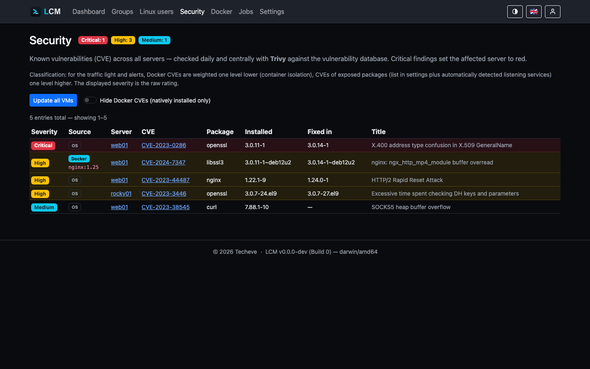

---
sidebar:
  order: 12
title: Security & CVE Scans
description: SSH hardening, firewall, 2FA, and the central Trivy CVE scan of the package inventory.
---

LCM bundles several security features - for the managed servers and for
the LCM instance itself. The deeper fundamentals (argon2id, JWT, RBAC,
encryption) are covered in the [Security Model](/en/reference/security-model/).

## CVE scan of the package inventory (Trivy)

The package inventory of **all** servers, centrally recorded in the database, is
regularly checked against the Trivy vulnerability database - **agentless**:
per server, a CycloneDX SBOM is generated from the package records and scanned
locally on the LCM host with `trivy sbom`. The managed servers are
**not** contacted again for this.

- **Schedule:** cron configurable (*Settings → General*), default
  daily 04:00.
- **After package updates:** whenever LCM updates packages (all/security/targeted
  updates, manually or via a rule), the package inventory is re-read and the
  server's CVE assessment is **re-run immediately and automatically** - so no
  stale security labels linger on packages that have already been fixed.
  (Only when the CVE scan is enabled and Trivy is available.)
- **Status effect:** critical CVE → status 🔴, high CVE → 🟡, each with
  an insight explanation. Badges sit right on the affected package row.
- **Views:** per server in the Security tab, globally on the Security page
  (most critical first).
- **Graceful degrade:** if Trivy is missing on the LCM host, the feature
  disables itself cleanly (notice in the UI and job log). Trivy is in no
  standard package source of Debian/Ubuntu and is therefore set up separately
  - see [Installation](/en/getting-started/installation/).
- **Alerts:** the "Security/CVE" alert rule notifies from a
  configurable minimum severity - see [Alerts](/en/guides/alerts/).

Docker images are scanned by the same procedure, see
[Docker Monitoring](/en/guides/docker/).

### The scanner runs sandboxed

Trivy is a child process of LCM and would therefore run with the same rights -
reaching `/var/lib/lcm`, where the database and the master key sit next to each
other. From those, the SSH keys and passwords of **all** managed servers could
be decrypted. This is not theory: in the Trivy supply chain compromise of March
2026, the injected binaries searched more than 50 paths for exactly this kind
of data.

LCM therefore starts the scanner in a sandbox. Of LCM's files, only what the
scan genuinely needs is visible:

| Visible to Trivy | Access |
| --- | --- |
| Trivy binary, system libraries, CA certificates | read |
| the generated SBOM (a single file) | read |
| the vulnerability database cache directory | read + write |
| its own, empty `/tmp` | read + write |

Everything else - `app.db`, `lcm.key`, `/etc/lcm`, the home directories - simply
**does not exist** for that process: a read attempt ends with "no such file",
not with "permission denied".

On top of that comes network separation: the **SBOM scan only evaluates the
local database and runs without any network at all**. Even a tampered scanner
would have no way out. Only the database download and the image scan get a
connection, because they cannot work without one.

This is implemented with **bubblewrap** (its own mount and network namespace,
installed together with Trivy). If it is missing, **Landlock** takes over,
provided the kernel has it enabled - careful: many kernels ship Landlock but do
not list it among the active LSMs (`/sys/kernel/security/lsm`); the Proxmox
kernel, for instance, does not without an `lsm=` boot parameter.

If neither is available, the scan runs unsandboxed as before - but with a
**visible notice** on the scanner display. A silent fallback would be the worst
option: you would believe yourself protected without being so.

### Status weighting

For **status and alerts**, the raw Trivy severity is weighted by context (the
Security page still shows the **raw** rating):

- **Docker CVEs do not count by default** - container isolation limits the
  blast radius, and the image vendor is responsible for image contents. Only
  containers marked as **CVE-relevant** in the Docker tab count, at full
  severity (see [Status calculation](/en/guides/status/)).
- **CVEs of exposed packages one level higher** - web servers, reverse proxies,
  mail/DNS/file servers, databases, etc. The list is maintained under *Settings →
  General* (`CVE high-weight packages`); LCM additionally detects packages
  listening on externally reachable ports and weights them up automatically.

### Security page: bulk update & Docker filter



The **Security page** (global CVE overview) offers two tools:

- **Update all VMs** - applies security updates on all reachable servers, one
  after another. While running, the button is disabled and shows progress
  (`x/N` servers done); afterwards it reports how many were updated or failed.
  At most one bulk run happens at a time.
- **Hide Docker CVEs** - a filter that shows only **natively installed** package
  findings (container findings are hidden). Each row's origin is marked as an
  **OS** or **Docker** badge (with image reference).

### Operating system out of support (EOL)

If a server runs a distribution that is **no longer receiving security updates**
(end-of-life) **or reaches end of support in less than a month**, the server is
classified as **red/critical** - regardless of individual CVEs. Support
timelines (Ubuntu/Debian release cycles) are built into LCM; the server detail
shows a "supported until …" or "support ends soon" badge.

### Status tier "Excellent"

Above 🟢 OK there is the **"Excellent"** tier (rich green): spotless - **not a
single** known CVE, SSH hardened **and** firewall active (Proxmox brings its own
firewall and counts as covered).

### How current is the vulnerability database?

Trivy downloads its database itself when scanning - but only with network access
to the registry. If the LCM host is isolated, sits behind a proxy or hits a rate
limit, **Trivy warns and keeps scanning with the old database**. The result is
then not an error but "no vulnerabilities found".

That is the dangerous variant: a three-week-old database looks exactly like a
genuinely clean server. LCM therefore states the database state explicitly:

- The **Security** page shows above the findings list when the database is from
  - with a warning if it is outdated. How much the list below is worth depends
  on exactly that.
- The server detail of the **LCM host** shows Trivy version and database state
  right on the Trivy card.
- If the database is outdated, every server gets a **note** in its status
  popover. Deliberately only a note: the traffic light stays unchanged, because
  this is a problem of the LCM host - colouring all servers for it would report
  one single cause as many server problems.

What counts is **when the vendor built the database**, not when this host
fetched it: re-downloading the same old database daily still leaves you with old
data.

| Age | Tier | Effect |
|---|---|---|
| < 48 h | current | nothing shown (Trivy refreshes on a 24-hour rhythm) |
| from 48 h | outdated | warning on the security page, note per server, alert |
| from 7 days | critical | as above, more prominently marked |

The 48 hours deliberately survive one failed nightly run without letting real
rot slip through.

**Updating the database**: the button on the security page downloads it right
away (`trivy --download-db-only`). It runs as a job - a failure lands in the log
together with Trivy's output, and that is exactly where the cause shows up (no
network, proxy, rate limit).

**Alert**: the rule *"CVE database outdated"* (Settings → Alerts) reports the
state actively. Without it the state would only surface if someone looked - for
a fault that looks like "no vulnerabilities" from the outside, that is the wrong
expectation. Only the LCM host is checked, since that is where the scanner is.

:::note[Outdated Trivy]
The **scanner version** needs no separate update check: LCM installs Trivy from
the Aqua APT repository, so it is a normal package of the LCM host and appears
in its update list like any other.
:::

### Which kernel is actually running?

The question sounds trivial and isn't: after a kernel update the new kernel is
**installed** but only runs after a reboot. The package list then claims
"everything up to date" while the machine keeps working with the old kernel -
including the holes the new one closes.

LCM separates the two cleanly:

- **Running kernel** - from `uname -r`. That is the only source that cannot
  lie: it reports the actually booted kernel, not what the package manager
  holds. Shown in the overview of the server detail page.
- **Installed kernels** - as a separate card, newest release first, each entry
  marked: *running*, *awaiting reboot* (newer than the running one) or
  *fallback* (older). The latter are what saves you when a new kernel does not
  boot - which is why they should be visible.

The list is collected per package manager with its own mechanism:

| System | Kernel packages |
|---|---|
| **Proxmox** (PVE/PBS/PMG) | `proxmox-kernel-*` and `pve-kernel-*` (older naming) |
| Debian / Ubuntu | `linux-image-*` |
| RHEL family (dnf/yum) | `kernel`, `kernel-core` |
| openSUSE / SLES | `kernel-default*` |
| Arch | `linux`, `linux-lts`, `linux-hardened`, `linux-zen` |
| Alpine | `linux-lts`, `linux-virt`, `linux-edge` |

Proxmox deliberately gets its own branch: there the kernels are **not**
provided by `linux-image` packages. A plain `linux-image` filter would simply
find nothing on a PVE host.

**Meta packages are skipped.** `linux-image-amd64` or `proxmox-kernel-6.8`
install no concrete kernel, they merely point at the newest one. Counting them
would distort the number of fallback kernels actually present.

:::note[In containers only the version counts]
In an **LXC container** (also Docker, OpenVZ, systemd-nspawn) the kernel of the
**host** is running. `uname -r` shows exactly that - installed kernel packages
would have no effect there. LCM therefore does not list them at all and shows
only the version with a corresponding note. There is no reboot finding either:
there is nothing you could restart from the inside.
:::

:::note[Keeping kernels]
Several kernels lying around is not an accident but a decision - and
`apt autoremove` undoes it. To keep the fallback, protect the kernel packages
with a [package pin](/en/guides/monitoring/#package-pins-what-the-cleanup-must-not-touch).
:::

## SSH hardening

On the server detail page a server can be **hardened**: LCM writes an
`sshd_config` drop-in that restricts login to **certificates**
(password login off). The hardening can be reversed again via toggle. A
hardened server is reconnected via the system SSH key.

## Firewall (ufw)

Per server or as a group rule, **ufw** can be enabled and a list
of TCP ports to open can be set (SSH always stays open). As a **baseline rule**
the desired port configuration is checked on every connection and restored
on deviation.

## Two-factor authentication (2FA)

Any user can set up a TOTP method under *My Account → Two-Factor*
(QR code for authenticator apps). Optionally, 2FA can be **enforced** for
certain roles (*Settings → General*,
`Enforce 2FA for roles`).

## Restricting network access to LCM (IP allowlist)

By default, any IP that can reach the LCM port may call the web UI and API
(access control then happens via login/RBAC). In addition, you can restrict
**network access** to specific client addresses - configured in `config.json`
(restart the service after changes). Clients that are not allowed receive a
**403** before login, logging or any controller runs.

```json
{
  "allowed_ips": ["private"],
  "trust_proxy_header": false
}
```

Each entry in `allowed_ips` is either a **keyword** or an **IP/CIDR**:

| Entry | Effect |
|---|---|
| `[]` (default) | no restriction - any IP may connect |
| `["localhost"]` | only the local machine (`127.0.0.0/8`, `::1`) |
| `["private"]` | private networks (RFC1918, IPv6 ULA, link-local) + localhost |
| `["203.0.113.5", "10.0.0.0/8"]` | exactly these addresses/ranges |

Entries can be mixed, e.g. `["localhost", "192.168.10.0/24"]`.

:::caution[Behind a reverse proxy]
Filtering uses the **direct TCP connection** (spoof-proof). If LCM runs behind
a reverse proxy (e.g. for TLS), the direct peer is the proxy - in that case set
`"trust_proxy_header": true` so LCM takes the client IP from `X-Forwarded-For`.
Only enable this if the proxy sets/overwrites that header itself - otherwise the
filter could be bypassed with a forged header.
:::

:::note[Docker healthcheck]
The Docker image checks health via `localhost`. With a restrictive allowlist
that omits `localhost`, the internal healthcheck fails - add `localhost` to the
list in that case.
:::

As an even stricter alternative, `"host": "127.0.0.1"` binds the service to the
loopback interface only (making it unreachable from outside entirely). The
allowlist is more flexible when selected remote addresses should be allowed.

## Access & roles

- **Admin** - full access.
- **Manager** - only assigned server groups (tenant separation at the
  query level).
- **Service accounts** - API keys with lifetime and scope (`read`/`readwrite`).

Details on permissions, tokens, and encryption:
[Security Model](/en/reference/security-model/).
