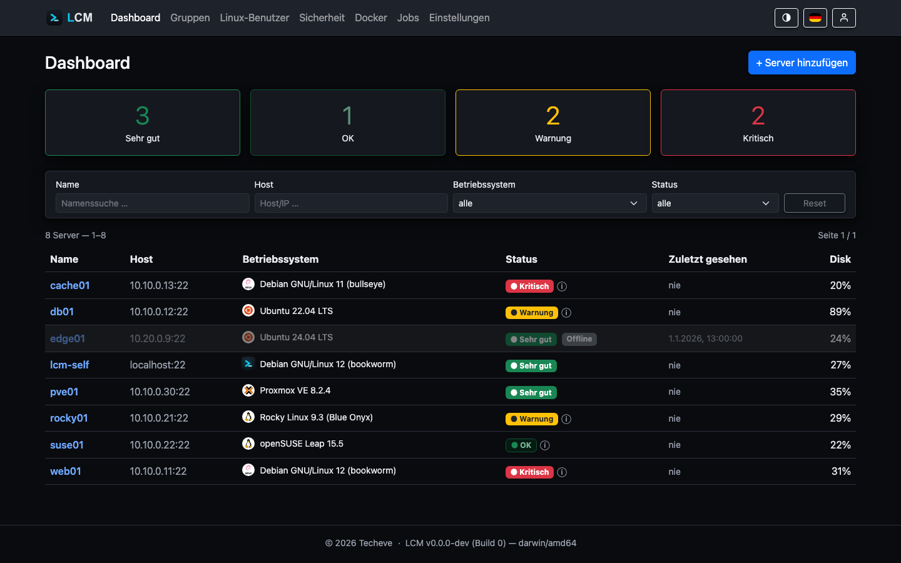

---
sidebar:
  order: 1
title: Überblick
description: Was LCM ist, welche Probleme es löst und wie es grob aufgebaut ist.
---

**LCM (Linux Centralized Management)** verwaltet beliebig viele Linux-Server
zentral über SSH - ohne Agent auf den Zielsystemen. Backend (Go) und Frontend
(Svelte 5) stecken in **einem einzigen Binary**, das seine Daten in einer
lokalen SQLite-Datei hält.

## Warum LCM?

- **Agentless.** Auf den verwalteten Servern muss nichts installiert werden.
  LCM verbindet sich per SSH, liest den Zustand aus und führt Aktionen als
  dedizierter Service-User aus.
- **Zero Trust pro Server.** Jeder Server bekommt beim Onboarding ein
  **eigenes** SSH-Schlüsselpaar. Ein kompromittierter Schlüssel gefährdet nie
  den gesamten Bestand.
- **Ein Binary, keine Laufzeitabhängigkeiten.** Kopieren, starten, fertig -
  auf Debian und Ubuntu (andere Linux-Distributionen laufen, sind aber nicht
  Teil unserer Tests).
- **Sicherheit eingebaut.** Sensible Daten liegen AES-256-GCM-verschlüsselt in
  der Datenbank, der Zugang ist per RBAC und optional 2FA geschützt.

## Kernfunktionen im Überblick

| Bereich | Was LCM tut |
|---|---|
| **Onboarding** | Geführtes Anbinden mit Host-Key-Bestätigung (MitM-Schutz), Service-User + eigenes Schlüsselpaar pro Server |
| **Monitoring** | Pakete, Updates, Repositories, Hardware; Ampel-Status **Sehr gut** / OK / 🟡 / 🔴 mit Insights (auch EOL & Erreichbarkeit) |
| **Festplatten** | Alle eingehängten Volumes mit Belegung; stündlicher Verlauf + Prognose des Root-Dateisystems |
| **CVE-Scan** | Täglicher Trivy-Scan des Paketbestands (SBOM-basiert, ohne erneuten Server-Kontakt), kontextabhängige Gewichtung |
| **Docker** | Inventar von Containern/Images, zentraler Registry-Update-Check, Image-CVE-Scan |
| **APT-Cache** | Anbindung an apt-cacher-ng per Ein-Klick-Aktion oder Gruppenregel |
| **Firewall** | Multi-Backend (ufw/firewalld/nftables) je Distribution, detaillierte Regeln mit Quell-Einschränkung (Allowlists + eigene IPs) |
| **Sicherheit-Tools** | fail2ban bzw. CrowdSec per Klick installieren; zentrale CrowdSec-LAPI auf dem LCM-Host |
| **IP-Allowlists** | Benannte, wiederverwendbare Quell-IP-Listen für Firewall, fail2ban und CrowdSec |
| **Automatisierung** | Servergruppen mit zeitgesteuerten und Grundsatz-Regeln, interner Scheduler; Aktionen wie Neustart, Rechte einschränken |
| **Benutzer** | Linux-Benutzer zentral verwalten und ihre SSH-Keys verteilen |
| **Backups** | Verschlüsselte, portable `.lcmbak`-Archive mit Restore beim Start |
| **Alarme** | Regelbasierte Benachrichtigungen (Festplatte, CVEs, Neustart, Heartbeat …) per E-Mail |
| **LCM Remote** | Server verbinden sich ausgehend per Agent (NAT/Roaming) - eigener Port, nur die Agent-Schnittstelle |
| **RouterOS** | MikroTik-Geräte anbinden und die Versions-Aktualität überwachen |
| **MCP** | Read-only-Schnittstelle für KI-Agenten (eigener Port, Authentifizierung, keine Geheimnisse) |

## Architektur in einem Satz

Ein HTTP-Server (Fiber) liefert das eingebettete Svelte-Frontend aus und stellt
eine REST-API bereit; ein interner Cron-**Scheduler** stößt Jobs an, die ein
**Executor** über kurzlebige SSH-Verbindungen auf den Zielservern ausführt und
als **Jobs** samt Konsolen-Output protokolliert.

Mehr Details: [Architektur](/reference/architecture/).

## Wie geht es weiter?

1. [Installation](/getting-started/installation/) - Binary, `.deb` oder Docker.
2. [Schnellstart](/getting-started/quickstart/) - ersten Server anbinden.
3. [Server & Monitoring](/guides/monitoring/) - der tägliche Arbeitsablauf.
