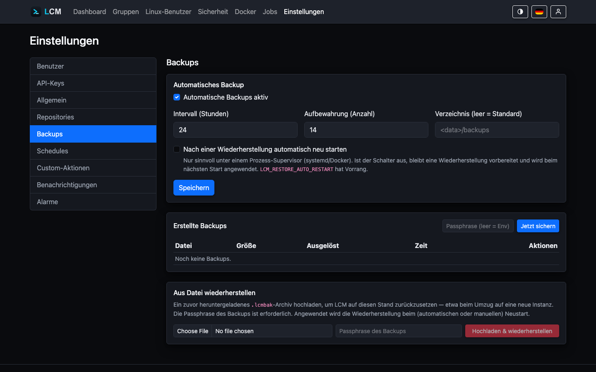

---
sidebar:
  order: 17
title: Backups
description: Verschlüsselte, portable .lcmbak-Archive erstellen, herunterladen und wiederherstellen.
---

LCM sichert seinen **eigenen** Zustand in ein passphrase-verschlüsseltes,
portables Archiv. Ein Backup enthält alles, was eine Instanz ausmacht - es lässt
sich auf einer **frischen** Instanz vollständig wiederherstellen.

## Was im Archiv steckt

Ein `.lcmbak` (ZIP mit AES-256-GCM / scrypt-Schlüsselableitung) bündelt:

- die **Datenbank-Momentaufnahme** (konsistenter SQLite-Snapshot),
- den **Master-Key** (`lcm.key`) - ohne ihn wären die at-rest verschlüsselten
  Felder unlesbar,
- die **Konfiguration** (`config.json`),
- das **TLS-Zertifikat**.

:::caution[Passphrase]
Die Backup-Passphrase kommt aus der Umgebungsvariable
`LCM_BACKUP_PASSPHRASE` (oder wird beim manuellen Erstellen abgefragt) und wird
**niemals** in Datenbank oder Konfiguration gespeichert. Ohne sie ist ein
Backup nicht wiederherstellbar - sicher aufbewahren.
:::



## Backup jetzt erstellen

Unter *Einstellungen → Backups* legt **„Backup jetzt erstellen"** sofort ein
Archiv an; die Passphrase wird dabei abgefragt. LCM zieht dafür eine
**konsistente** Momentaufnahme der Datenbank (`VACUUM INTO`) - ein Backup
lässt sich also im laufenden Betrieb erstellen.

## Automatische Backups

Damit automatische Backups laufen, braucht es **genau zwei Dinge** - beides
zeigt die Seite *Einstellungen → Backups* direkt an:

1. **„Automatische Backups aktiv"** ist eingeschaltet (Standard: an, alle
   24 Stunden).
2. Die **Passphrase ist als Umgebungsvariable gesetzt** -
   `LCM_BACKUP_PASSPHRASE` für den LCM-Dienst. Ein unbeaufsichtigtes Backup
   kann sie nicht abfragen; ohne sie schlägt **jedes** geplante Backup fehl
   (sichtbar als fehlgeschlagener Job „System-Backup" auf der *Jobs*-Seite).

Ob die Passphrase gesetzt ist, zeigt die Backups-Seite als Badge
(**„Passphrase gesetzt"** / **„Passphrase fehlt"**); fehlt sie bei aktivierten
automatischen Backups, erscheint zusätzlich eine deutliche Warnung mit
Anleitung. So setzt du sie - als systemd-Drop-in
(`/etc/systemd/system/lcm.service.d/backup.conf`):

```ini
[Service]
Environment=LCM_BACKUP_PASSPHRASE=ein-langes-geheimnis
```

danach:

```bash
systemctl daemon-reload && systemctl restart lcm
```

Oder im Docker-Compose:

```yaml
services:
  lcm:
    environment:
      LCM_BACKUP_PASSPHRASE: ein-langes-geheimnis
```

:::caution
Ohne gesetzte `LCM_BACKUP_PASSPHRASE` schlägt ein geplantes Backup mit einem
Passphrase-Fehler fehl - es entsteht kein unverschlüsseltes Archiv. Manuelle
Backups funktionieren weiterhin (Passphrase wird im Formular abgefragt).
:::

Weitere Einstellungen:

- **Intervall** (Stunden) und **Aufbewahrung** (Anzahl) - ältere Backups
  werden automatisch bereinigt.
- **Uhrzeit** - verankert den Zeitplan an einer festen Uhrzeit (Serverzeit).
  Teilt das Intervall den Tag (1, 2, 3, 4, 6, 8, 12 oder 24&nbsp;Stunden),
  läuft das Backup zu festen, daraus abgeleiteten Zeiten - z.&nbsp;B.
  Intervall 12&nbsp;h und Uhrzeit 03:30 → Läufe um 03:30 und 15:30. Andere
  Intervalle laufen relativ; dort sichert der Nachhol-Watchdog den Takt ab.
- **Zielverzeichnis** - ist immer gesetzt und mit dem Standard vorbelegt
  (`backup_dir` aus config.json, sonst `<Datenverzeichnis>/backups`). Es lässt
  sich frei ändern - praktisch für ein persistentes/externes Volume; ein
  geleertes Feld setzt beim Speichern den Standard wieder ein.

### Überfällige Backups werden nachgeholt

Bei Intervallen, die sich nicht als feste Uhrzeit ausdrücken lassen, zählt
der Zeitplan ab dem Start der Instanz. Damit eine Instanz, die
**häufiger neu startet als das Intervall lang ist** (z.&nbsp;B. durch
regelmäßige Updates), trotzdem gesichert wird, prüft ein Watchdog alle paar
Minuten: Ist das jüngste Backup älter als das Intervall (oder existiert noch
keines), wird **sofort ein Backup nachgeholt** - kurz nach dem Start, ohne
Zutun. Auch ein frisches manuelles Backup zählt dabei als Abdeckung des
Intervalls.

## Wiederherstellen

Zwei Wege:

1. **Aus der Historie** - ein früheres Backup direkt zur Wiederherstellung
   auswählen.
2. **Aus hochgeladenem Archiv** - ein `.lcmbak` hochladen, auch auf einer
   **frischen** Instanz (Fresh-Instance-Restore).

Der Restore läuft über **Staging + Apply-on-Startup**: LCM legt die
wiederherzustellenden Dateien bereit und wendet sie beim nächsten Start an.
Ob LCM sich dafür selbst neu startet, steuert `RestoreAutoRestart` bzw. die
Umgebungsvariable `LCM_RESTORE_AUTO_RESTART` - sinnvoll nur unter einem
Prozess-Supervisor (systemd/Docker mit Restart-Policy). Ist Auto-Restart aus,
bleibt der Restore vorbereitet und der Betreiber startet manuell.

Die Umgebungsvariable hat **Vorrang** vor der UI-Einstellung (truthy sind
`1`, `true`, `yes`, `on`). Beim geordneten Neustart beendet sich LCM mit einem
Nicht-Null-Exit-Code, damit `Restart=on-failure` (systemd) bzw. eine
Docker-Restart-Policy greift:

```ini
[Service]
Environment=LCM_RESTORE_AUTO_RESTART=1
Restart=on-failure
```

:::tip
Nach dem Anstoßen einer Wiederherstellung meldet die UI dich automatisch ab -
die Sitzung der alten Instanz ist danach nicht mehr gültig.
:::
