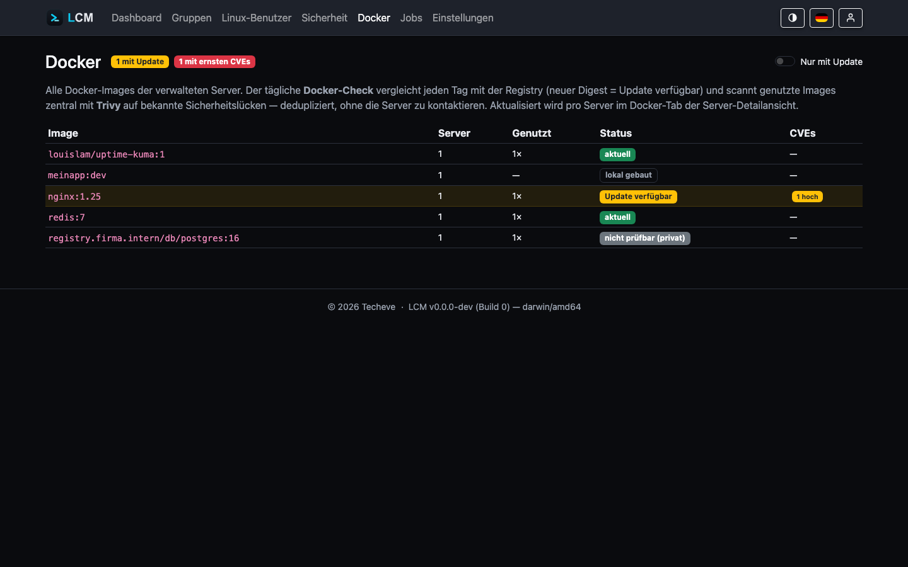
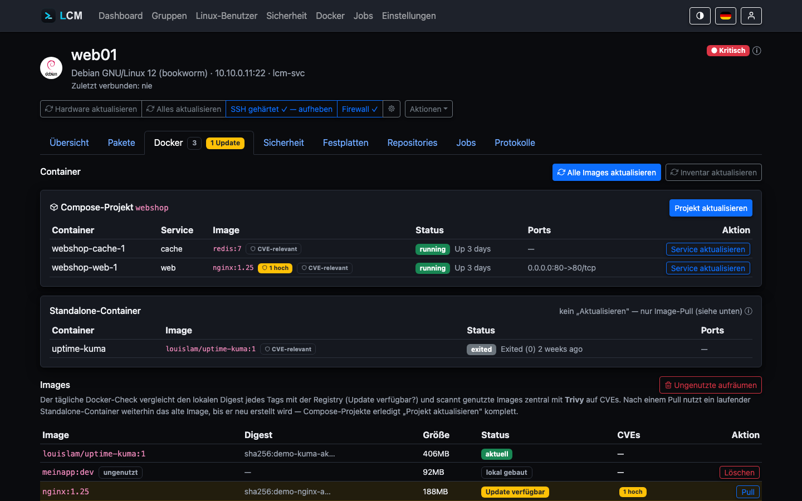

---
sidebar:
  order: 13
title: Docker-Monitoring
description: Container- und Image-Inventar, zentraler Registry-Update-Check und Image-CVE-Scans.
---

LCM erfasst das Docker-Inventar jedes Servers und prüft zentral, ob Images
veraltet oder verwundbar sind. Der Update-Check läuft komplett auf dem
LCM-Host - die Server werden dafür nicht kontaktiert.

## Inventar (agentless)

Der System-Sync erfasst pro Server:

- **Container** (`docker ps -a`) inkl. Zuordnung zum Compose-Projekt über die
  `com.docker.compose.*`-Labels,
- **Images** (`docker images --digests`).

Die Server-Flags `has_docker` / `has_compose` zeigen an, ob Docker bzw. Compose
vorhanden ist. Podman und Compose v1 sind außerhalb des Funktionsumfangs.

## Zentraler Update-Check

Der **Docker-Check** ist Teil des täglichen System-Sync (siehe
[Monitoring](/guides/monitoring/)). Er fragt die Registry-HTTP-API nach dem
aktuellen Digest hinter jedem Tag und vergleicht ihn mit dem lokal erfassten
Digest - **dedupliziert** pro Referenz (`nginx:1.25` auf 12 Servern = 1
Registry-Call). Ergebnis pro Image:

- **Update verfügbar** - die Registry führt einen neueren Digest.
- **nicht prüfbar (privat)** - private Registry, anonym nicht abfragbar.
- **lokal gebaut** - kein Registry-Digest, nicht prüfbar.

Die **globale Docker-Seite** listet jedes eindeutige Image über alle
sichtbaren Server hinweg, mit Nutzungszähler und CVE-Badges - praktisch, um
z. B. auf einen Blick zu sehen, wie viele Server noch ein veraltetes
`nginx:1.25` fahren:



## Image-CVE-Scan

Im selben Lauf scannt LCM die **genutzten** Images mit Trivy - adressiert per
`repo@digest` (exakt der laufende Stand) und dedupliziert pro (Repository,
Digest). Die Funde landen in derselben Schwachstellen-Tabelle wie der
Paket-Scan. In **Ampel und Alarme** fließen sie standardmäßig **nicht** ein -
nur für Container, die in der Container-Tabelle als **CVE-relevant** markiert
sind, zählen die Image-CVEs mit voller Schwere (kritisch → 🔴, hoch → 🟡;
siehe [Status-Berechnung](/guides/status/)). Veraltete genutzte Images → 🟡.

## Aktionen

Auf dem Docker-Tab eines Servers stehen (siehe Screenshot unten, Server
`web01`): ein Compose-Projekt mit zwei Services (`webshop`) und ein
Standalone-Container (`uptime-kuma`), darunter das Image-Inventar mit dem
CVE-relevant-Umschalter je Container.



- **Compose-Projekt aktualisieren** - `docker compose pull && up -d` im
  `working_dir` des Projekts. Für einen einzelnen Service im Projekt geht das
  auch gezielt über „Service aktualisieren“.
- **Standalone-Image aktualisieren** - `docker pull` (die Neuerstellung des
  Containers bleibt bewusst beim Betreiber, siehe Hinweis im UI).
- **Alle Images aktualisieren** - zieht in einem Job alle genutzten,
  getaggten Registry-Images des Servers auf einmal (`docker pull` je Image);
  lokal gebaute Images bleiben unangetastet.
- **CVE-relevant markieren** - Umschalter je Container: standardmäßig fließen
  Docker-CVEs **nicht** in Ampel/Alarme ein (siehe
  [Status-Berechnung](/guides/status/)); der Umschalter macht einen Container
  ausdrücklich relevant, wenn sein Image z. B. direkt von außen erreichbar ist.
- **Ungenutztes Image löschen** - einzeln per Button (`docker rmi`).
- **Aufräum-Regel** - die Gruppen-Regel „Docker: ungenutzte Images aufräumen“
  (`docker-prune`) räumt zeitgesteuert per `docker image prune -af` auf.

Alle Aktionen laufen als protokollierter SSH-Job mit anschließendem
Inventar-Rescan.

**Beispiel:** Ein Server betreibt zehn Container aus fünf verschiedenen
Images, nur `nginx:1.25` läuft nach außen exponiert (Port 80/443). Statt
alle fünf Images pauschal als CVE-relevant zu behandeln, genügt es, den
einen `nginx`-Container zu markieren - seine CVEs zählen dann voll in die
Ampel, die übrigen vier Images bleiben außen vor, solange niemand sie
ebenfalls markiert.

## Server-Schalter: zusehen statt eingreifen

Unter **Server → Einstellungen → Docker** stehen zwei Schalter, mit denen ein
Server aus dem Docker-Betrieb von LCM herausgenommen werden kann. Beide sind
ab Werk **aus**; es ändert sich also nichts, solange niemand sie umlegt.

### Keine Docker-Updates einspielen

LCM spielt auf diesem Server keine neuen Image-Versionen mehr ein - weder von
Hand (Compose-Update, Image-Pull, „Alle Images aktualisieren“) noch über eine
Regel (`docker-update-unused`). Die Aktionen werden abgelehnt, ein Regellauf
über eine Gruppe überspringt den Server mit einem Vermerk im Protokoll statt
fehlzuschlagen.

**Das Monitoring bleibt vollständig:** Inventar, verfügbare Updates und der
Image-CVE-Scan laufen weiter. Abgeschaltet ist das Einspielen, nicht das
Hinsehen - man sieht also weiterhin, was ausstünde.

Gedacht für Server, deren Container an anderer Stelle gepflegt werden: eine
eigene CI/CD-Strecke, ein Anbieter, der die Wartung übernimmt, oder eine
Umgebung mit festgelegten Wartungsfenstern. Dort ist ein Update aus LCM
heraus nicht falsch konfiguriert, sondern schlicht nicht erwünscht.

### CVEs aus Container-Images ignorieren

Die Funde aus den Container-Images dieses Servers bleiben ganz außen vor: Sie
zählen nicht für Ampel und Alarme und erscheinen nicht in der
**Sicherheitsübersicht** - auch nicht über deren Quellen-Filter „Docker“.

:::caution[Der Schalter sticht die Ausnahmen]
Er wirkt auch auf Container, die als **CVE-relevant** markiert sind, und auf
solche, die **an der Host-Firewall vorbei** aus dem Netz erreichbar sind -
die sonst [automatisch mitzählen](#docker-und-die-host-firewall-ufw). Wer die
Funde eines Servers gar nicht sehen will, meint alle; die Verantwortung
dafür liegt damit sichtbar bei dem, der ihn umlegt.
:::

Im **CVE-Bericht des Servers selbst** stehen die Funde weiterhin. Das ist
Absicht: Dort ist der Kontext eindeutig, der Schalter liegt daneben, und man
soll sehen können, was man ausblendet. Die Übersicht über alle Server wird
ruhig, die Wahrheit über den einzelnen bleibt greifbar.

Sinnvoll, wenn die Images von einem Anbieter kommen, für dessen Inhalte man
nicht verantwortlich ist - und wenn die Alternative wäre, eine dauerhaft rote
Liste zu ignorieren. Ein Bestand, auf den niemand mehr schaut, ist schlechter
als einer, der ehrlich sagt, dass er nicht betrachtet wird.

## Docker und die Host-Firewall (ufw)

Docker legt seine Weiterleitungsregeln in der `nat/PREROUTING`-Kette ab -
**vor** der `INPUT`-Kette, in der ufw filtert. Ein mit `-p 3001:3001`
veröffentlichter Container-Port ist deshalb von außen erreichbar, **auch wenn
ufw aktiv ist und ihn nicht freigibt**. Das ist kein Fehler, sondern Absicht:
Docker will, dass veröffentlichte Ports funktionieren.

LCM erkennt das und **qualifiziert die Firewall-Anzeige** entsprechend: In der
Server-Übersicht steht dann neben „Firewall: Aktiv" ein Hinweis mit den
betroffenen Ports und ihren Containern. **LCM greift dabei nicht ein** - ob ein
Port öffentlich sein soll, ist eine Betriebsentscheidung und je Container
verschieden.

Zusätzlich zählen von außen erreichbare Container **automatisch für die
CVE-Bewertung**. Docker-Funde fließen sonst nur ein, wenn ein Container
ausdrücklich als CVE-relevant markiert ist (siehe [Status-Berechnung](/guides/status/)) -
ein aus dem Netz erreichbarer Container ist dafür der stärkste Kandidat.

### Einen Port tatsächlich schließen

Drei Wege, mit unterschiedlichen Kosten:

**1. An Loopback binden (empfohlen für interne Dienste).** Die sauberste
Einzelfall-Lösung: Der Port ist nur noch lokal erreichbar, davor gehört dann
ein Reverse-Proxy.

```yaml
# docker/docker-compose.yml
ports:
  - "127.0.0.1:3001:3001"   # statt "3001:3001"
```

**2. `DOCKER-USER`-Kette (für differenzierte Regeln).** Docker durchläuft
diese Kette vor seinen eigenen Regeln und fasst sie nie an. Verbreitet ist das
Regelwerk [`ufw-docker`](https://github.com/chaifeng/ufw-docker). Zu beachten:
Die Regeln referenzieren **Container-IPs**, nicht Host-Ports - sie müssen bei
Änderungen am Stack mitgepflegt werden.

```sh
iptables -I DOCKER-USER -i <extern> -p tcp --dport 3001 -j DROP
```

**3. `iptables: false` in `/etc/docker/daemon.json` - nicht empfohlen.**
Docker verwaltet dann gar keine iptables-Regeln mehr. Damit brechen
Container-Ausgangs-NAT und die Kommunikation zwischen Containern, solange man
nicht das gesamte Regelwerk selbst nachbaut. Docker rät ausdrücklich davon ab.

:::tip[Vorher nachmessen]
Ob und wie stark der Effekt auf einem System auftritt, hängt von der
Docker-Version ab. Ein `iptables -t nat -L DOCKER -n` auf dem Host plus ein
Portscan von außen zeigt den tatsächlichen Zustand in zwei Minuten.
:::

## LCM selbst mit Docker betreiben

LCM kann auch **als** Container laufen (nicht zu verwechseln mit dem
Docker-Monitoring der verwalteten Server). Siehe
[Installation](/getting-started/installation/) und
[Paketierung](/reference/packaging/) für Dockerfiles, Compose-Beispiel und alle
Härtungs-Flags.
