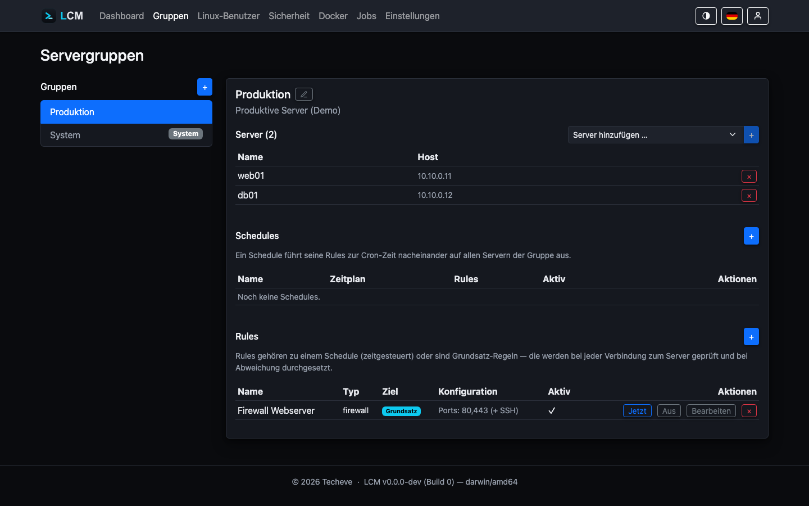

---
sidebar:
  order: 15
title: Gruppen, Schedules & Regeln
description: Server bündeln und mit zeitgesteuerten sowie Grundsatz-Regeln automatisieren.
---

**Servergruppen** bündeln Server, um sie gemeinsam zu automatisieren. Eine
Gruppe hat **Schedules** (Zeitpläne) und **Regeln**; ein Schedule führt seine
Regeln zur Cron-Zeit nacheinander auf allen Servern der Gruppe aus.



## Zwei Arten von Regeln

| Art | Wann sie läuft | Beispiele |
|---|---|---|
| **Geplante Regel** | zur Cron-Zeit ihres Schedules | tägliche Updates, Sync, Skripte, APT-Cache anbinden |
| **Grundsatz-Regel (Enforce)** | bei **jeder** Verbindung (mind. beim Health-Ping) | Firewall, APT-Cache erzwingen - mit Drift-Check |

Eine Grundsatz-Regel prüft zuerst den Ist-Zustand und greift **nur bei
Abweichung** ein. Beispiel Firewall: Ist die erwartete Port-Konfiguration schon
aktiv, passiert nichts; weicht sie ab, wird sie neu angewendet. Jeder
tatsächliche Eingriff erscheint als Audit-Eintrag und im Protokoll - eine
Änderung an einem Produktivsystem soll nicht nur im Output eines fremden Jobs
stehen.

Möglich sind Grundsatz-Regeln deshalb nur für Typen, die überhaupt einen
Soll-Zustand tragen: **Firewall**, **APT-Cache**, **ACL einrichten** und
**Rechte-Soll halten**.

Die letzten beiden gehören zu den [Berechtigungsprofilen](/guides/linux-users/):
„ACL einrichten" rüstet fehlende ACL-Unterstützung nach, damit die
Verzeichnisrechte eines Profils auf neuen Mitgliedern der Gruppe überhaupt
wirken; „Rechte-Soll halten" stellt gehärtete Verzeichnisse und gesetzte
Verzeichnisrechte wieder her, wenn ein Paketupdate sie zurückgesetzt hat.
Umgekehrt lassen sie sich **nicht** an einen Zeitplan hängen - sie beschreiben
einen Zustand, keine Aktion zu einer Uhrzeit.

Ein Shell-Kommando trägt umgekehrt gar keinen Soll-Zustand: Als Grundsatz-Regel
liefe es bedingungslos bei jedem Health-Check. Dafür ist ein **Zeitplan** der
richtige Ort - dort erscheint jede Ausführung als eigener Job.

## Vorrang: wenn mehrere Gruppen denselben Server regeln

Ein Server darf in beliebig vielen Gruppen sein. Tragen zwei davon eine
Grundsatz-Regel **desselben Typs**, beschreiben sie denselben Soll-Zustand
unterschiedlich - es kann sich nur eine durchsetzen. Welche das ist, entscheidet
der **Vorrang** der Gruppe: **die kleinere Zahl gewinnt** (Leserichtung wie bei
MX- und SRV-Records).

| Gruppe | Vorrang | Bedeutung |
|---|---|---|
| eigene Gruppen | **100** (Standard) | frei wählbar von 1 bis 9999 |
| System-Gruppe | **1000** | bewusst der schwächste - ihre Regeln gelten für alle Server und sind die Grundlinie, die eine spezifischere Gruppe überstimmen darf |

Die zurückgestellte Regel wird nicht ausgeführt, aber im Bericht des
Health-Checks ausdrücklich benannt:

```
Grundsatz-Regeln:
  [Basis-Firewall] firewall ok - regel umgesetzt (ports: 22,443)
  [Web-Firewall] übersprungen - Vorrang liegt bei Gruppe "Basis-Härtung" (10).
```

Haben beide Gruppen **denselben** Vorrang, entscheidet die ältere Gruppe. Das
ist deterministisch, aber es ist keine Entscheidung, die jemand getroffen hat -
LCM meldet solche Fälle deshalb beim Start im Protokoll und weist im
Health-Bericht auf den Gleichstand hin. Setze den Vorrang dann ausdrücklich.

Regeln **verschiedener** Typen stehen nicht im Widerspruch (Firewall und
APT-Cache betreffen Verschiedenes) - die laufen weiterhin alle. Und geplante
Regeln sind vom Vorrang gar nicht betroffen: Zwei Update-Läufe aus zwei Gruppen
sind kein Konflikt, sondern zwei Jobs.

:::caution[Firewall-Grundsatzregel: der Soll-Zustand ist Pflicht]
Eine Firewall-Grundsatzregel muss ausdrücklich sagen, welche Ports offen sein
sollen - als JSON (`[{"port":443,"proto":"tcp"}]`) oder als Portliste
(`"443,8080"`). Ohne Angabe wird die Regel **abgewiesen**: sie hätte sonst auf
allen Servern der Gruppe alle Dienstports geschlossen und sich alle
15&nbsp;Minuten selbst wiederhergestellt. Soll wirklich **nur SSH** offen sein,
ist das mit der leeren Liste `[]` ausdrücklich anzugeben.
:::

## Regel-Typen

- **Update / Paket-Updates / Security** - Paketaktualisierung über die erkannte
  Paketverwaltung; „benannt“ aktualisiert gezielt einzelne Pakete. Alle drei
  frischen die Paketliste vorher selbst auf - ein Lauf gegen veraltete
  Metadaten meldet sonst „erfolgreich" und lässt ein gerade veröffentlichtes
  Paket liegen. Einzige Ausnahme ist **pacman mit benannten Paketen**: Dort
  wäre ein `-Sy` vor der Installation der klassische Weg in ein halb
  aktualisiertes System (das Paket aus der frischen Datenbank, seine
  Abhängigkeiten alt). Auf Arch aktualisiert man alles oder nichts.
- **Paketliste aktualisieren** - frischt die Metadaten auf und macht danach die
  Bestandsaufnahme: Sie aktualisiert also LCMs eigene Sicht (installierte
  Pakete, verfügbare Updates), von der Dashboard, Ampel und CVE-Bewertung
  leben. Läuft ohnehin täglich im System-Zeitplan für alle Server; eine eigene
  Regel lohnt nur, wenn eine Gruppe häufiger aufgefrischt werden soll.
- **Skript** - beliebiges Shell-Kommando.
- **Custom-Aktion** - eine unter *Einstellungen → Custom-Aktionen* hinterlegte
  Kommando-Liste, die sequenziell läuft.
- **Sync / Health / Paketliste** - die Bausteine der Basis-Zeitpläne.
- **Firewall** - die Firewall aktivieren und die angegebenen Ports freigeben
  (auch als Grundsatz-Regel; dort ist der Soll-Zustand Pflicht, siehe oben).
- **Docker-Prune** - ungenutzte Docker-Images aufräumen.
- **Docker: ungenutzte Images aktualisieren** - zieht neue Versionen
  ungenutzter Images (z. B. um Basis-Images für den nächsten Build
  vorzuhalten, ohne laufende Container anzufassen).
- **APT-Cache anbinden / erzwingen** - siehe [APT-Cache](/guides/apt-cache/).
- **Neustart** - startet den Server neu (`systemctl reboot`); nur als
  geplante Regel sinnvoll, nicht als Grundsatz-Regel. Der Job bleibt offen,
  bis der Server wieder antwortet (siehe unten).
- **Neustart bei Bedarf** - dasselbe, aber nur, wenn das System selbst einen
  Neustart anfordert (`/var/run/reboot-required`, `needs-restarting -r`,
  `zypper needs-rebooting`). Gefragt wird **beim Lauf**, nicht der zuletzt
  erfasste Stand: Zwischen dem letzten Scan und dem Wartungsfenster liegt
  genau das Update, das den Neustart nötig macht. Meldet der Server keinen
  Bedarf, endet der Job mit „Kein Neustart nötig - übersprungen". Das ist
  die Regel fürs wöchentliche Wartungsfenster: Auszeit nur, wenn sie etwas
  bringt.

:::note[Nicht jeder Regel-Typ ist gruppenseitig wählbar]
Im Domain-Modell und in der OpenAPI-Referenz tauchen weitere Typen auf -
`cve-scan`, `alert-check`, `backup` und `docker-check`. Diese laufen
**ausschließlich als System-Zeitpläne** mit festem Intervall und lassen sich
nicht als Gruppenregel anlegen; ein entsprechender Versuch wird mit
„ungültiger rule-typ" abgelehnt. Die obige Liste ist also abschließend für
das, was unter *Gruppe → Regeln* wählbar ist.
:::

**Beispiel:** Eine Gruppe „Webserver“ mit Schedule „Nächtlich“
(`0 3 * * *`) bekommt zwei Regeln - zuerst „Security-Updates“, danach
„Neustart“ (nur falls der Update-Lauf einen Kernel aktualisiert hat und
`RebootRequired` gesetzt ist, macht der Neustart überhaupt Sinn; siehe
[Monitoring](/guides/monitoring/)). Zusätzlich sichert eine Grundsatz-Regel
„Firewall“ mit den Ports `80,443` ab, dass die Firewall-Konfiguration bei
jeder Verbindung geprüft und bei Abweichung sofort wiederhergestellt wird -
unabhängig vom nächtlichen Zeitplan.

## Ein Neustart wartet auf die Rückkehr

Ein Neustart - ob per Ein-Klick-Aktion in der Server-Detailansicht oder als
geplante Regel - endet nicht mit dem Absetzen des Kommandos. LCM prüft danach
im Hintergrund, ob der Server zurückkommt:

| | |
|---|---|
| Anlaufsperre | 15 Sekunden, bevor der erste Versuch zählt |
| Prüfabstand | alle 2 Sekunden |
| Zeitfenster | 10 Minuten |

Die Anlaufsperre ist nicht optional: Das Neustart-Kommando kehrt sofort
zurück, der Server fährt aber erst Sekunden später herunter. Ohne sie träfe
der erste Versuch den noch laufenden Server - und der Neustart wäre als
abgeschlossen gemeldet, bevor er begonnen hat.

**Kommt der Server zurück**, schließt der Job mit der Wartedauer ab („Server
nach 42s wieder erreichbar"), der Server gilt wieder als erreichbar, und die
Datenerfassung läuft einmal an. Das ist der Punkt, an dem sich der laufende
Kernel, die Betriebszeit und ein zuvor angefordertes „Neustart erforderlich"
ändern - der Stand von vor dem Neustart ist überholt.

**Kommt er nicht zurück**, scheitert der Job nach 10 Minuten mit genau dieser
Aussage samt letztem Verbindungsfehler. Ein Server, der nach einem Neustart
nicht wiederkommt, steht damit als Vorfall da und nicht als erledigte Aktion.

Solange die Überwachung läuft, bleibt der Job offen und hält die Server-Sperre
- während eines Neustarts soll ohnehin nichts anderes auf dem Server laufen.

## Eine Regel anlegen

import { Steps } from '@astrojs/starlight/components';

<Steps>

1. Unter *Gruppen* die Gruppe wählen (oder neu anlegen) und ihr Server
   zuweisen.
2. Für eine geplante Regel zuerst einen **Schedule** anlegen (Name +
   Cron-Ausdruck, z.&nbsp;B. `0 2 * * *`).
3. Über **„+ Neue Regel“** Typ, Ziel (Schedule *oder* Grundsatz) und ggf.
   Konfiguration (Ports, Paketnamen, Aktion) setzen.
4. Mit **„Jetzt“** lässt sich eine Regel oder ein ganzer Schedule sofort
   auslösen.

</Steps>

## Die System-Gruppe

Die geschützte System-Gruppe bringt die Basis-Zeitpläne (Health-Check,
System-Sync) mit; ihre Regeln und Zeitpläne sind nicht löschbar. Ihre Schedules
laufen auf **allen** Servern - unabhängig von der Gruppenzugehörigkeit. Details
siehe [Monitoring](/guides/monitoring/).

## Gut zu wissen

- Eine später geänderte Konfiguration (z.&nbsp;B. eine neue APT-Cache-URL) wirkt
  durch die Grundsatz-Regel automatisch auf alle Server der Gruppe.
- Demo-Server werden nie per SSH kontaktiert - Regel-Läufe werden dort
  simuliert.
