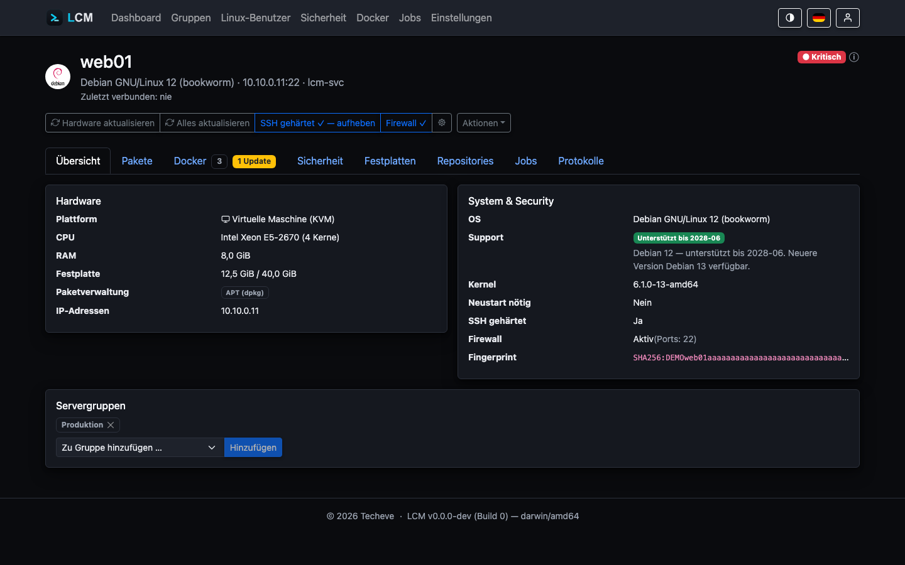

---
sidebar:
  order: 10
title: Server & Monitoring
description: Bestandsaufnahme, Ampel-Status, Speicher-Verlauf und die Basis-Zeitpläne verstehen.
---

LCM erfasst für jeden angebundenen Server regelmäßig den Ist-Zustand und
verdichtet ihn zu einem Ampel-Status. Der Kontakt läuft über kurzlebige
SSH-Verbindungen; die verwalteten Server brauchen keinen Agent.

## Was erfasst wird

- **Betriebssystem & Plattform** - Distribution, Version, Kernel, Virtualisierung
  (Bare-Metal, VM, LXC) und OS-Support-Status (Ubuntu, Debian sowie die
  RHEL-Familie: Red Hat Enterprise Linux, Rocky Linux, AlmaLinux, CentOS Stream).
- **Hardware** - CPU-Modell/Kerne, RAM, Festplatte, IP-Adressen.
- **Festplatten/Volumes** - alle eingehängten Dateisysteme (durchgereichte
  Speicher-Volumes, nicht physische Platten) mit Belegung; das Root-Volume `/`
  bleibt maßgeblich für Ampel und Prognose.
- **Neustart erforderlich** - LCM erkennt, wenn der Server einen Neustart
  anfordert (z.&nbsp;B. nach Kernel-Update, wie Ubuntus Login-Hinweis).
- **Pakete** - installierte Pakete inkl. verfügbarer Updates; getrennt nach
  Paketverwaltung (apt/dpkg, dnf/yum/RPM, zypper, pacman, apk) und **Snap**.
- **Repositories** - hinterlegte Paketquellen samt Sicherheitsbewertung
  (HTTPS, signiert). Der pflegbare Katalog bekannter Paketquellen
  (Einstellungen → Repositories) ist je Eintrag einer Paketverwaltung
  zugeordnet und wird nur auf passenden Servern angeboten; die
  APT-Cache-Anbindung (apt-cacher-ng) gilt ausschließlich für apt-Systeme.

  Unverschlüsselte Quellen lassen sich mit einer Schaltfläche geschlossen auf
  **https** umstellen; schlägt `apt-get update` danach fehl, rollt LCM die
  Änderung zurück. Die Umstellung ist **umkehrbar**: LCM hebt die
  Sicherungskopien der Quellen-Dateien unter `/var/backups/lcm-apt-https` auf
  und weiß dadurch später noch, welche Quelle vorher http war. Die
  Rückstellung betrifft **nur diese** - eine Fremdquelle, die von sich aus
  https spricht, bleibt unangetastet. Auf Servern, die vor LCM&nbsp;1.27
  umgestellt wurden, gibt es kein solches Protokoll mehr; dort bietet LCM die
  Spiegel der Distribution (`*.debian.org`, `*.ubuntu.com`,
  `*.raspberrypi.org`) zur Rückstellung an. Welche Quellen betroffen sind,
  zeigt die Bestätigung vor dem Ausführen.
- **Docker** - Container (inkl. Compose-Projekten) und Images, siehe
  [Docker-Monitoring](/guides/docker/).
- **Anwendungen** - Software, die nicht über die Paketverwaltung installiert
  wurde (AdGuard Home, Nextcloud, mailcow …), samt der laufenden Dienste, die
  zu keinem Paket gehören, siehe [Anwendungen](/guides/apps/).

## Ampel-Status & Insights

Jeder Server hat einen Status 🟢 **Sehr gut** (sattes Grün), 🟢 **OK** (helles
Grün), 🟡 (Warnung) oder 🔴 (Kritisch). Der Status ergibt sich aus mehreren
Signalen - u.&nbsp;a. Erreichbarkeit, CVE-Funden (kritisch → rot, hoch → gelb),
überfälligen Updates, knappem Speicher, angefordertem Neustart und OS-Support.
Über das **ⓘ** am Status öffnet sich ein Popover, das die konkreten Gründe
(„Insights“) auflistet - du musst nie raten, warum ein Server nicht grün ist.

### Red Hat: Registrierung zählt mit

Auf Systemen mit `subscription-manager` liest LCM den Registrierungsstand mit.
Der Grund ist ein Trugschluss, der sonst unbemerkt bliebe: Ein **nicht
registriertes RHEL bekommt keine Paketquellen**. `dnf` findet dort nichts -
nicht, weil alles aktuell wäre, sondern weil niemand nachschauen konnte. Ohne
diesen Befund stünde so ein Server mit „0 überfällige Updates" da und sähe
damit besser aus als ein gepflegter, der ehrlich drei offene Updates meldet.

Gemeldet wird deshalb **🟡**, wenn das System nicht registriert ist oder seine
Registrierung keine ausreichende Berechtigung trägt. „Disabled" gilt als in
Ordnung - bei Simple Content Access prüft Red Hat keine Berechtigungen mehr,
und das ist der Regelfall. Rocky, AlmaLinux und CentOS kennen
`subscription-manager` nicht; dort entfällt der Befund.

Ein Betriebssystem **außerhalb des Supports** (End-of-Life) oder **in weniger
als einem Monat** vor dem Support-Ende setzt den Server auf **🔴 Kritisch**
(siehe [Sicherheit & CVE-Scans](/guides/security-cve/)).

**Sehr gut** erreicht ein Server nur makellos: keine einzige bekannte CVE
(auch keine niedrigen), SSH-Härtung aktiv und Firewall (ufw) aktiv -
Proxmox-Systeme bringen ihre eigene Firewall mit und zählen als abgedeckt.
**OK** erlaubt einzelne CVEs geringer Schwere, solange alle Updates
(einschließlich Security-Updates) eingespielt sind.

Für Ampel und Alarme werden CVEs **gewichtet**: Funde aus Docker-Images zählen
standardmäßig **gar nicht** - nur für Container, die im Docker-Tab als
**CVE-relevant** markiert sind, fließen sie mit voller Schwere ein. Funde
exponierter Pakete - Webserver, Proxys, SSH-/Mail-/DNS-Server, Datenbanken
(Liste unter *Einstellungen → Allgemein*, plus automatisch erkannte Dienste,
die auf von außen erreichbaren Ports lauschen) - zählen eine Stufe höher. Die
angezeigte Schwere in den Sicherheits-Ansichten bleibt die Roh-Bewertung.

Alle Faktoren, Schwellwerte und Sonderfälle im Detail:
[Status-Berechnung](/guides/status/).

## Festplatten, Verlauf & Prognose

Der **Festplatten-Tab** (englisch *Disks*) der Detailseite listet alle
eingehängten **Volumes** (durchgereichte Dateisysteme, keine physischen Platten)
mit Gerät, Typ und Belegungsbalken. Das **Root-Volume `/`** ist mit „System“
markiert und bleibt maßgeblich für Dashboard-Ampel, Verlauf und Prognose - es
ist der kritische Faktor, wenn es voll läuft.

Der Health-Check misst die Belegung des Root-Dateisystems **stündlich**
(gedrosselt) und verdichtet sie zu **Tagesdurchschnitten**. Der Tab zeigt daraus
einen Verlauf (beim Überfahren mit der Maus erscheint der Prozentwert des
jeweiligen Tages) und rechnet per **linearer Regression** hoch, wann die
Kapazität erschöpft ist („Unbegrenzt“ ab mehr als einem Jahr). Die Aufbewahrung
der Tages-Snapshots ist einstellbar (90-365 Tage, *Einstellungen → Allgemein*).

:::note[Komprimierende Dateisysteme]
LCM liest die tatsächlich **belegten Blöcke** (`df`), nicht die logische
Dateigröße. Auf ZFS oder Btrfs mit aktivierter Kompression liegt die belegte
Menge deshalb unter der Summe der Dateigrößen - das ist korrekt und kein
Messfehler, kann aber überraschen, wenn man beide Werte vergleicht.
:::

### Weitere Volumes überwachen

Überwacht wird von sich aus nur `/`. Jedes weitere Volume lässt sich im
Festplatten-Tab **einzeln dazuschalten** - mit eigener Warngrenze in Prozent.

Warum nicht alle: Ein Datenträger darf voll sein. Ein Archiv **soll** voll
werden, und eine Sicherungsplatte bei 95 % ist kein Mangel, sondern
bestimmungsgemäß. Ungefragt zu melden hieße, Meldungen zu erzeugen, die man
wegklickt - und wer sich das angewöhnt, klickt die wichtigen mit weg.

Überwacht ein Volume, prüft LCM zweierlei:

- **Belegung** gegen die eingestellte Grenze (Vorgabe 85 %; zusätzlich lässt
  sich eine kritische Grenze setzen).
- **Inodes** gegen dieselbe Grenze. Ein Dateisystem kann dichtmachen, obwohl
  in Bytes reichlich frei ist - typisch bei vielen kleinen Dateien
  (Maildirs, Session-Dateien, Paket-Caches). ZFS und Btrfs vergeben Inodes
  dynamisch: Sie nennen zwar eine Zahl, aber eine gerechnete - ein 32-GB-Dataset
  meldet 65 Millionen Inodes bei 1 % Belegung. Die Prüfung schlägt dort deshalb
  nie an, und das ist richtig so: Erschöpfen kann sich dieser Vorrat nicht.

Unabhängig von jeder Einstellung meldet LCM ein Volume, das **nur lesbar**
eingehängt ist. Der Kernel schaltet ein Dateisystem nach einem I/O- oder
Metadatenfehler selbsttätig auf `ro`, damit kein weiterer Schaden entsteht -
bis zum ersten Schreibversuch fällt das sonst niemandem auf.

:::note[Netzspeicher wird angezeigt, aber nicht überwacht]
NFS, CIFS/SMB, SSHFS, CephFS und Verwandte erscheinen in der Liste - man will
sehen, was eingehängt ist -, lassen sich aber nicht überwachen. Für Füllstand
und Gesundheit ist der Dienst zuständig, der den Speicher anbietet. Von hier
aus wäre nur die Sicht des Clients sichtbar: Jeder Netz-Aussetzer käme als
Speicherproblem an, ohne dass am Speicher selbst etwas wäre.
:::

## Zustand der Speicher-Verbünde

Ein volles Dateisystem sieht man an der Belegung. Was man dort **nicht** sieht:
einen ZFS-Pool, der seit drei Wochen `DEGRADED` läuft, weil eine Platte
ausgefallen ist. Btrfs, das still Prüfsummenfehler zählt. Ein Software-RAID
ohne Redundanz. Einen LVM-Thin-Pool, dessen Metadaten volllaufen.

Keines dieser Systeme meldet sich von selbst - man muss nachsehen, und genau
das tut im Alltag niemand regelmäßig. LCM erhebt diese Zustände bei jedem Scan
mit und zeigt sie im Festplatten-Tab.

| Technik | Erhoben wird | Beanstandet wird |
|---|---|---|
| **ZFS** | `zpool list`, `zpool status` | Pool nicht `ONLINE`, Lese-/Schreib-/Prüfsummenfehler |
| **Btrfs** | `btrfs device stats`, `filesystem show` | gezählte Gerätefehler, fehlendes Gerät im Verbund |
| **Software-RAID** | `/proc/mdstat` | Verbund läuft ohne die vorgesehene Redundanz (`[U_]`) |
| **LVM-Thin** | `lvs` | Daten oder Metadaten über 80 %, ab 95 % kritisch |

Die Erhebung ist rein lesend. `zpool` und `/proc/mdstat` lassen sich ohne
Sonderrechte lesen; `btrfs device stats` und `lvs` verweigern sich dem
Dienstbenutzer - dafür läuft der Scan über `sudo`. Im **eingeschränkten
Modus** (ohne allgemeines sudo) melden Btrfs und LVM-Thin „unbekannt" - bewusst
kein Zustand, denn ein falsches Gesund wäre schlimmer als Nichtwissen. Fehlt die
Technik auf einem Server - der Regelfall -, entsteht kein Eintrag und kein
Aufwand. Anders als die Belegung einzelner Volumes ist dieser Teil **nicht
abschaltbar**: Er kostet nichts, und ein degradierter Pool ist keine
Geschmacksfrage.

Ein behobener Defekt verschwindet beim nächsten Scan von selbst: Der Zustand
wird bei jedem Durchgang vollständig neu erhoben, nicht fortgeschrieben. Wird
ein Verbund ausgebaut oder ein Pool exportiert, bleibt ebenfalls kein Eintrag
von gestern stehen.

:::caution[Thin-Pools früher warnen]
Die Grenzen für LVM-Thin liegen bewusst niedriger als bei einem gewöhnlichen
Dateisystem. Ein voller Thin-Pool lässt sich nicht mehr aufräumen - die
Erweiterung braucht selbst freien Platz -, und ein volles Metadaten-Volume
kostet den Pool endgültig. Wer hier erst bei 95 % aufwacht, kommt zu spät.
:::

## Offline-Kennzeichen

Ein Server bekommt das Kennzeichen **Offline**, sobald er bei **zwei
aufeinanderfolgenden** Kontaktversuchen nicht erreichbar war - im Dashboard
wie in der Server-Detailansicht.

Warum erst beim zweiten: Ein einzelner Fehlschlag ist im Betrieb Alltag
(Paketverlust, ein gerade laufender Neustart, ein kurzer Netz-Aussetzer) und
noch keine Aussage. Erst die Wiederholung trennt „gerade nicht erreicht" von
„ist offline". Jeder erfolgreiche Kontakt setzt den Zähler zurück - „in Folge"
heißt in Folge.

Gezählt wird jeder Erreichbarkeits-Kontakt: der Health-Ping (Standard alle
15 Minuten), Refresh-Läufe und Rule-Ausführungen. Ein von LCM selbst
ausgelöster **Neustart** zählt bewusst nicht mit - der Server ist dann
erwartungsgemäß kurz weg, das ist kein fehlgeschlagener Check. Kommt er nicht
zurück, zählen ihn die nächsten Health-Pings ohnehin.

:::note[Unabhängig von der Ampel]
Das Kennzeichen sagt nur, dass der Server nicht antwortet - nicht, wie schlimm
das ist. Ob die Nichterreichbarkeit toleriert wird, steuert die **Farbe**
(siehe unten), nicht die Tatsache. Früher hing das Kennzeichen an dieser
Einstellung und erschien ausgerechnet bei ganz normal ausgefallenen Servern
nicht.
:::

## Nichterreichbarkeit unkritisch

Standardmäßig gilt ein nicht erreichbarer Server sofort als **🔴 Kritisch**. Für
Server, die planmäßig zeitweise offline sind (Außenstellen, Roaming-Geräte),
lässt sich das pro Server über *Einstellungen → Verfügbarkeit* umstellen:

- Ist **Nichterreichbarkeit unkritisch** aktiviert, wird ein Offline-Server
  **nicht** sofort kritisch. Er **behält seinen zuletzt bekannten Status** und
  wird im Dashboard nur **ausgegraut** (weiterhin anklickbar).
- Erst nach Ablauf der **Frist bis kritisch** (Tage, Standard **28**, einstellbar
  1-365) ununterbrochener Nichterreichbarkeit springt er wegen
  Nichterreichbarkeit auf Rot.

## Wartung

„Nichterreichbarkeit unkritisch" dämpft die Bewertung eines Servers, der
erreichbar sein **soll**. **Wartung** sagt etwas anderes: dass er es gerade
nicht soll.

Der Schalter unter *Einstellungen → Wartung* nimmt einen Server vorübergehend
ganz aus dem Betrieb:

- keine Zeitplan-Läufe (Health-Check, System-Sync, Updates, Grundsatz-Regeln),
- keine Frühwarnung und kein CVE-Scan - ihr Paketbestand ist eingefroren, ein
  Befund wäre eine Aussage über den Stand von damals,
- keine Alarme.

Der Server bleibt erfasst und sichtbar; in Liste und Detailansicht trägt er ein
gelbes **Wartung**-Kennzeichen samt Datum. Gedacht ist das für Systeme, die
absichtlich aus sind: eine abgeschaltete Testumgebung, ein Gerät im Umbau, eine
Maschine, deren Ressourcen gerade woanders gebraucht werden.

:::note[Warum das nicht nur Kosmetik ist]
Ohne diesen Zustand zählt „aus" als „gestört". Ein einziges stillgelegtes System
erzeugt so alle 15 Minuten eine Unerreichbar-Warnung - im Betrieb waren das
binnen einer Woche über tausend Zeilen für einen einzigen Server, und in dem
Rauschen gehen die echten Störungen unter.
:::

Das Ein- und Ausschalten steht im Audit-Log (`server.maintenance.start` /
`server.maintenance.end`): Wer die Überwachung eines Servers stilllegt, soll
nachvollziehbar sein.

## Basis-Zeitpläne (System-Gruppe)

Jede Installation hat eine geschützte **System-Gruppe** mit zwei
nicht-löschbaren Zeitplänen, die auf **allen** Servern laufen:

| Zeitplan | Standard | Inhalt |
|---|---|---|
| **Health-Check** | alle 15 Min | Erreichbarkeit prüfen; dabei Grundsatz-Regeln durchsetzen und Speicher messen |
| **System-Sync** | täglich 04:00 | Hardware & Linux-Benutzer synchronisieren, Paketliste aktualisieren, zentralen Docker-Check ausführen |

:::note[Der Ping läuft nicht doppelt]
Ein erfolgreicher Job **ist** das Lebenszeichen eines Servers. Hat innerhalb des
Health-Takts schon etwas anderes mit ihm gesprochen - ein Sync, ein Update, ein
Neustart -, entfällt der Ping: Er erführe nichts Neues. Maßgeblich ist der Takt
des Zeitplans selbst, nicht eine feste Zahl; stellst du ihn auf fünf Minuten,
schrumpft das Fenster mit.

Der planmäßige Ping wird dadurch nie verschluckt (beim nächsten Lauf ist der
vorige Kontakt genau einen Takt alt), und bleibt der Kontakt aus, läuft er
ohnehin wieder. In der Nacht, wenn Sync und Updates ohnehin auf allen Servern
arbeiten, verschwindet er dagegen fast vollständig - genau in dem Fenster, in
dem die Maschine die Last am wenigsten brauchen kann.

Ein **von Hand** ausgelöster Health-Check läuft immer: Wer ihn anstößt, will
einen frischen Kontakt.
:::

## Wenn zwei Zeitpläne denselben Server treffen

Auf einem Server läuft immer höchstens **ein** Job - zwei gleichzeitige Zugriffe
auf dieselbe Paketverwaltung wären ein Systemkonflikt. Trifft ein Zeitplan auf
einen belegten Server, wird sein Lauf deshalb nicht mehr verworfen, sondern
**eingereiht**: Er steht als `pending` in der Job-Liste und startet, sobald der
laufende Job fertig ist.

Die Reihenfolge in der Warteschlange:

1. **Stärkster Gruppen-Vorrang zuerst.** Maßgeblich ist die Priorität der
   Gruppe, aus der die Regel stammt (kleiner = stärker; die System-Gruppe hat
   bewusst den schwächsten Vorrang, damit Health-Check und Sync sich nicht vor
   fachliche Regeln drängen).
2. **Bei gleichem Vorrang der zuerst Ausgelöste.** Zwei Gruppen mit demselben
   Rang bleiben untereinander fair und vorhersagbar.
3. **Ein laufender Job wird nie verdrängt.** Der Vorrang entscheidet über die
   Warteschlange, nicht über einen Abbruch - alles andere machte ein halb
   eingespieltes Update möglich.

Zwei Regeln halten die Schlange kurz:

- **Dieselbe Regel steht nur einmal an.** Läuft ein einstündiges Update, stünden
  sonst vier Health-Checks hintereinander, die alle dasselbe prüfen.
- **Wer zu lange wartet, fällt heraus.** Die Frist ist der halbe Takt des
  eigenen Zeitplans. Danach ist der nächste Durchgang näher als der eigene
  Start - der Wartende wäre beim Laufen schon überholt. Er wird mit Begründung
  als `blocked` abgeschlossen, nicht stillschweigend verschluckt.

:::note[Aktionen von Hand warten nicht]
Wer einen Knopf drückt, während etwas läuft, bekommt weiterhin sofort eine
Absage („auf diesem Server läuft bereits ein Job"). Eine stille Verzögerung wäre
dort unehrlich - jemand steht davor und wartet auf eine Antwort. Eingereiht
werden nur Zeitplan-Läufe; die haben keinen Menschen vor sich, sondern einen
Takt.
:::

Wartende Jobs lassen sich in der Job-Liste abbrechen wie laufende - sie geben
dabei keine Sperre frei, sondern nur ihren Platz in der Schlange.

## Aktualisieren auf Knopfdruck

Auf der Server-Detailseite:

- **Hardware aktualisieren** - schneller Hardware-/Paket-Scan.
- **Alles aktualisieren** - vollständiger Sync inkl. Docker-Inventar und
  Live-Status (z.&nbsp;B. APT-Cache-Anbindung, Firewall).

## Pakete pflegen (aktualisieren, aufräumen, entfernen)

Der **Pakete**-Tab der Server-Detailseite bündelt alle Paket-Aktionen. Sie
laufen als Job und funktionieren distributionsübergreifend (apt, dnf/yum,
zypper, pacman, apk) - LCM wählt automatisch das passende Kommando.

| Aktion | Was sie tut | Kommando (Beispiel apt) |
|---|---|---|
| **Alle aktualisieren** | alle verfügbaren Updates einspielen | `apt-get -y upgrade` |
| **Nur Security/Bugfix** | nur Sicherheits-/Bugfix-Updates (soweit die Distribution einen eigenen Kanal hat; pacman/apk kennen keinen → volles Update) | `apt-get install --only-upgrade …` |
| **Aufräumen** (autoremove) | nicht mehr benötigte Pakete / verwaiste Abhängigkeiten entfernen | `apt-get -y autoremove` |
| **Version…** (je Paket) | eine bestimmte installierbare Version wählen (Downgrade erlaubt) | `apt-get install -y --allow-downgrades name=version` |
| **Entfernen** (je Paket) | ein Paket gezielt deinstallieren | `apt-get -y remove name` |

Das **Aufräumen** ist das Gegenstück zum ewig anwachsenden Paketbestand: nach
vielen Updates bleiben alte Kernel-Metapakete, ersetzte Bibliotheken und
verwaiste Abhängigkeiten liegen. Pro Paketverwaltung nutzt LCM das jeweils
richtige Mittel - `apt/dnf autoremove`, zypper `packages --unneeded` +
`remove --clean-deps`, pacman-Orphans (`pacman -Qdtq | pacman -Rns`). apk
räumt Abhängigkeiten schon beim Deinstallieren selbst ab und meldet das ehrlich.

Als **geplante Gruppen-Regel** gibt es „Aufräumen (autoremove)" ebenfalls -
so hält ein Zeitplan den Paketbestand ganzer Servergruppen dauerhaft schlank
(siehe [Automatisierung](/guides/monitoring/#basis-zeitpläne-system-gruppe)).

### Snaps aktualisieren und entfernen

Snaps waren lange nur eine Liste - die Spalte „Update" zeigte, dass eines
bereitliegt, einspielen ließ es sich nur auf der Konsole. Der Reiter **Snaps**
bietet jetzt dieselben Aktionen wie die Paket-Ansicht: **alle aktualisieren**
(`snap refresh`), ein **einzelnes aktualisieren** und **entfernen**.

Zwei Unterschiede zu apt, beide beabsichtigt:

- **Keine Versionsauswahl.** Ein Snap trägt Revisionen und einen Kanal; ein
  Downgrade läuft über `snap revert` und ist etwas anderes als ein
  versionsgenaues `apt install`. Ein Feld, das gleich aussieht, aber anderes
  tut, wäre irreführend.
- **`snapd` und die Basis-Snaps** (`core`, `core22`, …) lassen sich nicht
  entfernen: Sie tragen alle übrigen Snaps. LCM bietet die Schaltfläche dort
  gar nicht erst an und weist den Aufruf zusätzlich serverseitig ab.

Entfernt wird ohne `--purge` - snapd legt vorher eine Momentaufnahme der
Snap-Daten an, die sich mit `snap restore` zurückholen lässt.

### Alte Kernel entfernen

Jedes Kernel-Update legt einen weiteren Kernel neben die vorhandenen - gewollt,
denn der vorige ist die Rückfallebene. Nach einem Jahr Updates liegen davon
aber mehrere in `/boot`, und genau diese Partition ist auf vielen
Installationen klein. Ein volles `/boot` bricht das nächste Kernel-Update
mitten im `dpkg`-Lauf ab.

Die Kernel-Karte auf dem Reiter **Übersicht** zeigt deshalb, was weg kann, und
bietet **Alte Kernel entfernen** an. Stehen bleiben immer:

- der **laufende** Kernel (`uname -r`),
- alles, was **neuer** ist als er - das aktiviert der nächste Neustart,
- der **nächstältere** als Rückfallebene.

Alles darunter wird samt Begleitpaketen entfernt (Module, Header, Tools). Die
Paketnamen werden nicht geraten, sondern auf dem Zielsystem gesucht; der
laufende Kernel wird im Skript ein zweites Mal ausgeschlossen, falls seit der
letzten Erfassung neu gestartet wurde. Derzeit nur auf apt-Systemen
(Debian, Ubuntu, Proxmox) und nur mit vollem sudo.

:::note[Die Kernel-Liste war früher zu kurz]
Bis 1.26 wurde das Kernel-Inventar nur beim **vollen** Server-Scan
aktualisiert. Auf regelmäßig aktualisierten Servern zeigte die Karte deshalb
dauerhaft zu wenige Kernel - die dazwischen installierten fehlten. Seit 1.27
zieht jede Paket-Aktion das Inventar mit nach.
:::

### Paket-Pins: was das Aufräumen NICHT anfassen darf

Der Aufräum-Lauf ist gründlich - zu gründlich für Kernel. Sobald ein älterer
Kernel keine Abhängigkeit mehr hat, räumt `apt autoremove` ihn weg. Genau der
wäre aber die Rückfallebene, wenn ein neuer Kernel nicht bootet. Proxmox macht
es vor und behält mehrere Versionen; mit **Paket-Pins** macht LCM das auf jedem
verwalteten Server möglich.

Ein Pin steht im Tab **Pakete** und hat zwei getrennte Wirkungen:

| Wirkung | Bedeutung | Wofür |
|---|---|---|
| **nicht entfernen** | Das Paket überlebt Aufräum-Läufe und das gezielte Entfernen, bekommt aber weiter Updates. | Kernel - mehrere Versionen behalten, Sicherheitsupdates trotzdem bekommen. |
| **Version einfrieren** | Die installierte Version bleibt stehen, es kommen keine Updates mehr. | Anwendungen mit heikler Versionsbindung. **Für Kernel gefährlich** - dann fehlen Sicherheitsupdates. |

Ein Pin gilt **global** (alle Server) oder **nur für diesen Server**; auf dem
Ziel wirkt die Summe aus beidem. Ein abschließendes `*` ist ein Präfix-Muster:
`linux-image-*` erfasst die ganze Kernel-Reihe. Die Schaltfläche **Kernel
schützen** legt genau diese Muster für die Paketverwaltung des Servers an -
bewusst als „nicht entfernen", nicht als Einfrieren.

Umgesetzt wird der Pin je Paketverwaltung mit deren eigenem Mittel:

| Paketverwaltung | nicht entfernen | Version einfrieren |
|---|---|---|
| apt | `APT::NeverAutoRemove` (`/etc/apt/apt.conf.d/99lcm-package-pins`) | `apt-mark hold` |
| dnf / yum | `/etc/dnf/protected.d/lcm-package-pins.conf` | `versionlock` (Plugin wird bei Bedarf nachinstalliert) |
| zypper | kein eigenes Mittel - LCM spart die Pakete beim Aufräum-Lauf aus | `zypper addlock` |
| pacman | `HoldPkg` | `IgnorePkg` |
| apk | entfällt (apk kennt kein Autoremove) | `apk hold`, sofern die apk-Version es kann |

Die Schaltfläche **Auf dem Server anwenden** schreibt die Dateien sofort; der
Aufräum-Lauf schreibt sie ohnehin selbst, bevor er entfernt. Das Anwenden ist
idempotent - in LCM gelöschte Pins verschwinden dabei auch auf dem Server.

:::note[Auf Proxmox ausgenommen]
Auf Proxmox VE/PBS/PMG ist das Feature deaktiviert: Proxmox verwaltet die
Kernel-Aufbewahrung selbst (eigene Meta-Pakete, `proxmox-boot-tool`). Eine
zweite Schutzliste daneben würde beide Mechanismen gegeneinander laufen lassen.
:::

:::caution[Geschützte Systempakete]
Das **gezielte Entfernen** ist mit einer Rückfrage abgesichert, und LCM lehnt
kritische Systempakete grundsätzlich ab: SSH-Server (Aussperr-Schutz), `sudo`
und die Init (LCM verlöre die Rechte), die Paketverwaltung selbst, Kernel und
libc. Der Versuch, eines davon zu entfernen, endet mit einer klaren Meldung -
nicht mit einem kaputten Server.
:::

## Jobs & Protokolle

Jede Aktion - ob geplant oder manuell - läuft als **Job** und wird mit exaktem
SSH-Konsolen-Output gespeichert (Secrets werden vor dem Speichern
unkenntlich gemacht). Die *Jobs*-Seite bietet Filter (Typ, Auslöser) und blendet
Health-Checks standardmäßig aus. Ein **Concurrency-Lock** pro Server verhindert
überlappende Jobs.
