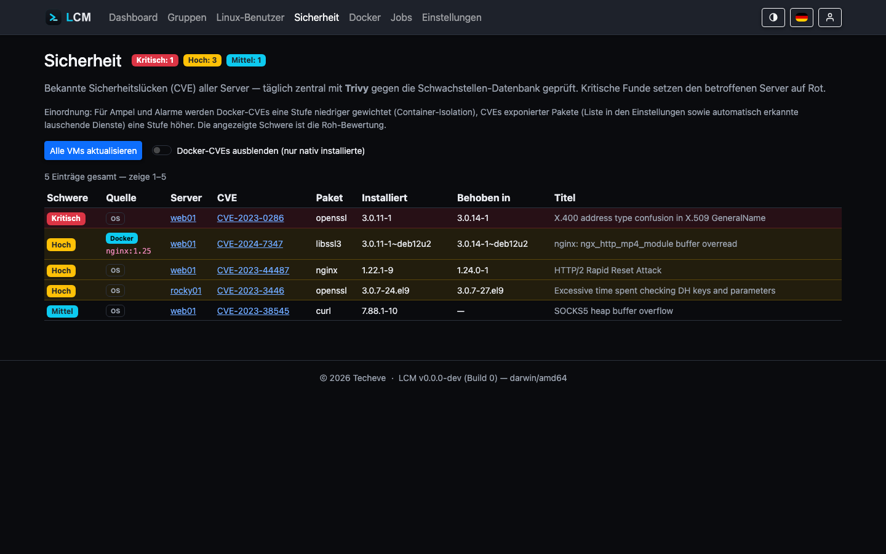

---
sidebar:
  order: 12
title: Sicherheit & CVE-Scans
description: SSH-Hardening, Firewall, 2FA und der zentrale Trivy-CVE-Scan des Paketbestands.
---

LCM bündelt mehrere Sicherheitsfunktionen - für die verwalteten Server und für
die LCM-Instanz selbst. Die tiefergehenden Grundlagen (argon2id, JWT, RBAC,
Verschlüsselung) stehen im [Sicherheitsmodell](/reference/security-model/).

## CVE-Scan des Paketbestands (Trivy)

Der zentral in der Datenbank erfasste Paketbestand **aller** Server wird
regelmäßig gegen die Trivy-Schwachstellendatenbank geprüft - **agentenlos**:
Pro Server wird aus den Paket-Records ein CycloneDX-SBOM erzeugt und lokal auf
dem LCM-Host mit `trivy sbom` gescannt. Die verwalteten Server werden dafür
**nicht** erneut kontaktiert.

- **Zeitplan:** Cron einstellbar (*Einstellungen → Allgemein*), Standard
  täglich 04:00.
- **Nach Paket-Updates:** Sobald LCM Pakete aktualisiert (alle/Security/gezielte
  Updates, ob manuell oder per Regel), wird der Paketbestand neu eingelesen und
  die CVE-Bewertung des Servers **sofort automatisch neu erstellt** - so bleiben
  keine veralteten Sicherheits-Labels an bereits behobenen Paketen hängen.
  (Nur wenn der CVE-Scan aktiviert und Trivy verfügbar ist.)
- **Status-Wirkung:** kritische CVE → Ampel 🔴, hohe CVE → 🟡, jeweils mit
  Insight-Begründung. Badges sitzen direkt an der betroffenen Paketzeile.
- **Sichten:** pro Server im Sicherheit-Tab, global auf der Security-Seite
  (kritischste zuerst).
- **Graceful Degrade:** Fehlt Trivy auf dem LCM-Host, deaktiviert sich das
  Feature sauber (Hinweis in UI und Job-Log). Trivy liegt in keiner
  Standard-Paketquelle von Debian/Ubuntu und wird deshalb separat eingerichtet
  - siehe [Installation](/getting-started/installation/).
- **Alarme:** Die Alarm-Regel „Security/CVE“ benachrichtigt ab einer
  konfigurierbaren Mindest-Schwere - siehe [Alarme](/guides/alerts/).

Docker-Images werden im selben Verfahren gescannt, siehe
[Docker-Monitoring](/guides/docker/).

### Der Scanner läuft eingesperrt

Trivy ist ein Kindprozess von LCM und liefe damit mit denselben Rechten - es
käme also an `/var/lib/lcm`, wo Datenbank und Master-Key nebeneinander liegen.
Daraus ließen sich die SSH-Schlüssel und Passwörter **aller** verwalteten
Server entschlüsseln. Das ist keine graue Theorie: Bei der
Lieferkettenkompromittierung von Trivy im März 2026 durchsuchten die
untergeschobenen Binaries über 50 Pfade nach genau solchen Daten.

LCM startet den Scanner deshalb in einer Sandbox. Sichtbar ist von LCMs
Dateien nur, was der Scan wirklich braucht:

| Sichtbar für Trivy | Zugriff |
| --- | --- |
| Trivy-Binary, Systembibliotheken, CA-Zertifikate | lesen |
| das erzeugte SBOM (eine einzelne Datei) | lesen |
| das Cache-Verzeichnis der Schwachstellen-Datenbank | lesen + schreiben |
| ein eigenes, leeres `/tmp` | lesen + schreiben |

Alles Übrige - `app.db`, `lcm.key`, `/etc/lcm`, die Home-Verzeichnisse - ist
für den Prozess schlicht **nicht vorhanden**: ein Leseversuch endet nicht mit
„keine Berechtigung", sondern mit „Datei nicht gefunden".

Dazu kommt die Netztrennung: Der **SBOM-Scan wertet nur die lokale Datenbank
aus und läuft ganz ohne Netz**. Selbst ein manipulierter Scanner hätte dabei
keinen Weg nach draußen. Verbindung bekommen nur der Datenbank-Download und
der Image-Scan, die ohne sie nicht arbeiten können.

Umgesetzt ist das mit **bubblewrap** (eigener Mount- und Netz-Namespace, kommt
mit der Trivy-Einrichtung mit). Ist es nicht vorhanden, greift ersatzweise
**Landlock**, sofern der Kernel es aktiviert hat - Vorsicht: viele Kernel
bringen Landlock zwar mit, führen es aber nicht in der aktiven LSM-Liste
(`/sys/kernel/security/lsm`); der Proxmox-Kernel etwa tut das ohne
`lsm=`-Bootparameter nicht.

Fehlt beides, läuft der Scan wie früher ungesperrt - dann aber mit einem
**sichtbaren Hinweis** an der Scanner-Anzeige. Ein stiller Rückfall wäre die
schlechteste Variante: Man hielte sich für geschützt, ohne es zu sein.

### Gewichtung der Ampel

Für **Ampel und Alarme** wird die rohe Trivy-Schwere kontextabhängig gewichtet
(die Security-Seite zeigt weiterhin die **Roh**-Bewertung):

- **Docker-CVEs zählen standardmäßig nicht** - Container-Isolation begrenzt
  den Blast-Radius, für Image-Inhalte ist der Image-Anbieter verantwortlich.
  Nur Container, die im Docker-Tab als **CVE-relevant** markiert sind, fließen
  mit voller Schwere ein (siehe [Status-Berechnung](/guides/status/)).
- **CVEs exponierter Pakete eine Stufe höher** - Webserver, Reverse-Proxies,
  Mail-/DNS-/Datei-Server, Datenbanken usw. Die Liste ist unter *Einstellungen →
  Allgemein* pflegbar (`CVE-Hochgewichtung`); zusätzlich erkennt LCM automatisch
  Pakete, die auf von außen erreichbaren Ports lauschen, und gewichtet sie hoch.

### Security-Seite: Sammel-Update & Docker-Filter



Auf der **Security-Seite** (globale CVE-Übersicht) gibt es zwei Werkzeuge:

- **Alle VMs aktualisieren** - spielt die Security-Updates auf allen
  erreichbaren Servern nacheinander ein. Während des Laufs ist die Schaltfläche
  deaktiviert und zeigt den Fortschritt (`x/N` Server abgeschlossen); danach
  meldet sie, wie viele aktualisiert wurden bzw. fehlschlugen. Es läuft immer
  höchstens ein Sammel-Lauf.
- **Docker-CVEs ausblenden** - ein Filter, der nur **nativ installierte**
  Paket-Lücken zeigt (Container-Funde werden ausgeblendet). Die Herkunft jeder
  Zeile ist als Badge **OS** bzw. **Docker** (mit Image-Referenz) markiert.

### Betriebssystem außerhalb des Supports (EOL)

Läuft auf einem Server eine Distribution, die **nicht mehr mit
Sicherheitsupdates versorgt** wird (End-of-Life) **oder in weniger als einem
Monat** ausläuft, wird der Server **rot/kritisch** eingeordnet - unabhängig von
einzelnen CVEs. Die Support-Fristen (Ubuntu-/Debian-Release-Zyklen) sind in LCM
hinterlegt; im Server-Detail zeigt ein Badge „unterstützt bis …“ bzw. „Support
endet bald“.

### Status-Stufe „Sehr gut“

Über 🟢 OK gibt es die Stufe **„Sehr gut“** (kräftiges Grün): makellos - **keine
einzige** bekannte CVE, SSH gehärtet **und** Firewall aktiv (Proxmox bringt seine
eigene Firewall mit und zählt als abgedeckt).

### Wie aktuell ist die Schwachstellen-Datenbank?

Trivy lädt seine Datenbank beim Scan selbst nach - aber nur mit Netzzugang zur
Registry. Ist der LCM-Host abgeschottet, hängt hinter einem Proxy oder läuft in
ein Rate-Limit, dann **warnt Trivy und scannt mit der alten Datenbank weiter**.
Das Ergebnis ist dann kein Fehler, sondern „keine Sicherheitslücken gefunden".

Das ist die gefährliche Variante: Eine drei Wochen alte Datenbank sieht in der
Übersicht genauso aus wie ein tatsächlich sauberer Server. Deshalb zeigt LCM
den Stand ausdrücklich an:

- Auf der Seite **Sicherheit** steht über der Fundliste, von wann die Datenbank
  ist - mit Warnung, wenn sie überaltert ist. Denn wie belastbar die Liste
  darunter ist, hängt genau daran.
- Im Server-Detail des **LCM-Hosts** stehen Trivy-Version und Datenbank-Stand
  direkt an der Trivy-Karte.
- Ist die Datenbank überaltert, bekommt jeder Server einen **Hinweis** im
  Status-Popover. Bewusst nur ein Hinweis: Die Ampel bleibt unverändert, weil es
  ein Problem des LCM-Hosts ist - alle Server deswegen einzufärben würde eine
  einzige Ursache vielfach als Server-Problem ausgeben.

Maßgeblich ist, **wann der Hersteller die Datenbank gebaut hat**, nicht wann
dieser Host sie geholt hat: Wer dieselbe alte Datenbank täglich neu herunterlädt,
hat trotzdem alte Daten.

| Alter | Stufe | Wirkung |
|---|---|---|
| < 48 h | aktuell | keine Anzeige (Trivy erneuert im 24-Stunden-Rhythmus) |
| ab 48 h | veraltet | Warnung auf der Sicherheitsseite, Hinweis je Server, Alarm |
| ab 7 Tagen | kritisch | wie oben, deutlicher hervorgehoben |

Die 48 Stunden überleben bewusst einen ausgefallenen Nachtlauf, ohne dass echtes
Verrotten durchrutscht.

**Datenbank aktualisieren**: Der Knopf auf der Sicherheitsseite lädt sie sofort
nach (`trivy --download-db-only`). Das läuft als Job - ein Fehlschlag landet
samt Ausgabe von Trivy im Protokoll, und genau dort steht dann die Ursache
(kein Netz, Proxy, Rate-Limit).

**Alarm**: Die Regel *„CVE-Datenbank veraltet"* (Einstellungen → Alarme) meldet
den Zustand aktiv. Ohne sie fiele er nur auf, wenn jemand hinsieht - bei einem
Fehler, der nach außen wie „keine Sicherheitslücken" aussieht, ist das die
falsche Erwartung. Geprüft wird nur der LCM-Host, denn dort liegt der Scanner.

:::note[Veraltetes Trivy]
Die **Version des Scanners** braucht keinen eigenen Update-Check: LCM
installiert Trivy aus dem Aqua-APT-Repository, es ist damit ein normales Paket
des LCM-Hosts und taucht in dessen Update-Liste auf wie jedes andere.
:::

### Welcher Kernel läuft gerade?

Die Frage klingt trivial und ist es nicht: Nach einem Kernel-Update ist der
neue Kernel **installiert**, läuft aber erst nach einem Neustart. Die
Paketliste behauptet dann „alles aktuell", während die Maschine weiter mit dem
alten Kernel arbeitet - inklusive der Lücken, die der neue schließt.

LCM trennt beides sauber:

- **Laufender Kernel** - aus `uname -r`. Das ist die einzige Quelle, die nicht
  lügen kann: Sie meldet den tatsächlich gebooteten Kernel, nicht das, was die
  Paketverwaltung vorhält. Steht in der Übersicht der Server-Detailseite.
- **Installierte Kernel** - als eigene Karte, neueste Fassung zuerst, mit
  Markierung je Eintrag: *läuft*, *wartet auf Neustart* (neuer als der
  laufende) oder *Rückfallebene* (älter). Letztere sind das, was einen rettet,
  wenn ein neuer Kernel nicht bootet - deshalb sollen sie sichtbar sein.

Erhoben wird die Liste je Paketverwaltung mit deren eigenem Mittel:

| System | Kernel-Pakete |
|---|---|
| **Proxmox** (PVE/PBS/PMG) | `proxmox-kernel-*` und `pve-kernel-*` (alte Namensgebung) |
| Debian / Ubuntu | `linux-image-*` |
| RHEL-Familie (dnf/yum) | `kernel`, `kernel-core` |
| openSUSE / SLES | `kernel-default*` |
| Arch | `linux`, `linux-lts`, `linux-hardened`, `linux-zen` |
| Alpine | `linux-lts`, `linux-virt`, `linux-edge` |

Proxmox bekommt bewusst einen eigenen Zweig: Dort stellen **nicht**
`linux-image`-Pakete die Kernel. Ein reiner `linux-image`-Filter fände auf
einem PVE-Host schlicht nichts.

**Meta-Pakete werden ausgelassen.** `linux-image-amd64` oder
`proxmox-kernel-6.8` installieren keinen konkreten Kernel, sie zeigen nur auf
den jeweils neuesten. Sie mitzuzählen würde die Zahl der tatsächlich
vorhandenen Rückfall-Kernel verfälschen.

:::note[In Containern zählt nur die Version]
In einem **LXC-Container** (auch Docker, OpenVZ, systemd-nspawn) läuft der
Kernel des **Hosts**. `uname -r` zeigt genau diesen - installierte
Kernel-Pakete wären dort wirkungslos. LCM listet sie deshalb gar nicht erst,
sondern zeigt nur die Version mit einem entsprechenden Hinweis. Einen
Neustart-Befund gibt es dort ebenfalls nicht: Es gibt nichts, was man von
innen neu starten könnte.
:::

:::note[Kernel behalten]
Dass mehrere Kernel liegen bleiben, ist kein Zufall, sondern eine Entscheidung
- und `apt autoremove` macht sie rückgängig. Wer die Rückfallebene behalten
will, schützt die Kernel-Pakete mit einem
[Paket-Pin](/guides/monitoring/#paket-pins-was-das-aufräumen-nicht-anfassen-darf).
:::

## SSH-Hardening

Auf der Server-Detailseite lässt sich ein Server **härten**: LCM schreibt ein
`sshd_config`-Drop-in, das den Login auf **Zertifikate** beschränkt
(Passwort-Login aus). Die Härtung ist per Toggle wieder aufhebbar. Ein
gehärteter Server wird beim Reconnect per System-SSH-Key wieder angebunden.

## Firewall (ufw)

Pro Server oder als Gruppen-Regel lässt sich **ufw** aktivieren und eine Liste
freizugebender TCP-Ports setzen (SSH bleibt immer offen). Als **Grundsatz-Regel**
wird die gewünschte Port-Konfiguration bei jeder Verbindung geprüft und bei
Abweichung wiederhergestellt.

## Zwei-Faktor-Authentifizierung (2FA)

Jeder Benutzer kann unter *Mein Konto → Zwei-Faktor* ein TOTP-Verfahren
einrichten (QR-Code für Authenticator-Apps). Optional lässt sich 2FA für
bestimmte Rollen **erzwingen** (*Einstellungen → Allgemein*,
`2FA erzwingen für Rollen`).

## Netzwerk-Zugriff auf LCM einschränken (IP-Allowlist)

Standardmäßig darf jede IP, die den LCM-Port erreicht, die Weboberfläche und
API aufrufen (Zugangskontrolle passiert danach über Login/RBAC). Zusätzlich
lässt sich der **Netzwerk-Zugriff** auf bestimmte Client-Adressen einschränken
- gesteuert über die `config.json` (nach Änderung Dienst neu starten). Nicht
zugelassene Clients erhalten **403**, noch bevor Login, Logging oder ein
Controller laufen.

```json
{
  "allowed_ips": ["private"],
  "trust_proxy_header": false
}
```

Jeder Eintrag in `allowed_ips` ist entweder ein **Schlüsselwort** oder eine
**IP/CIDR**:

| Eintrag | Wirkung |
|---|---|
| `[]` (Default) | keine Einschränkung - jede IP darf zugreifen |
| `["localhost"]` | nur die lokale Maschine (`127.0.0.0/8`, `::1`) |
| `["private"]` | private Netze (RFC1918, IPv6-ULA, Link-Local) + localhost |
| `["203.0.113.5", "10.0.0.0/8"]` | genau diese Adressen/Bereiche |

Die Einträge lassen sich mischen, z.&nbsp;B. `["localhost", "192.168.10.0/24"]`.

:::caution[Hinter einem Reverse-Proxy]
Gefiltert wird die **direkte TCP-Verbindung** (fälschungssicher). Läuft LCM
hinter einem Reverse-Proxy (z.&nbsp;B. für TLS), ist die direkte Gegenstelle
der Proxy - dann `"trust_proxy_header": true` setzen, damit LCM die Client-IP
aus `X-Forwarded-For` nimmt. **Nur** aktivieren, wenn der Proxy diesen Header
selbst setzt bzw. überschreibt - sonst ließe sich der Filter mit einem
gefälschten Header umgehen.
:::

:::note[Docker-Healthcheck]
Das Docker-Image prüft die Gesundheit über `localhost`. Bei einer restriktiven
Allowlist ohne `localhost` schlägt der interne Healthcheck fehl - dann
`localhost` in die Liste aufnehmen.
:::

Als noch strengere Alternative bindet `"host": "127.0.0.1"` den Dienst gleich
nur an die Loopback-Schnittstelle (er ist dann von außen gar nicht erreichbar).
Die Allowlist ist flexibler, wenn ausgewählte entfernte Adressen zugreifen
dürfen sollen.

## Zugriff & Rollen

- **Admin** - voller Zugriff.
- **Manager** - nur zugewiesene Servergruppen (Mandantentrennung auf
  Query-Ebene).
- **Service-Accounts** - API-Keys mit Laufzeit und Scope (`read`/`readwrite`).

Details zu Rechten, Tokens und Verschlüsselung:
[Sicherheitsmodell](/reference/security-model/).
